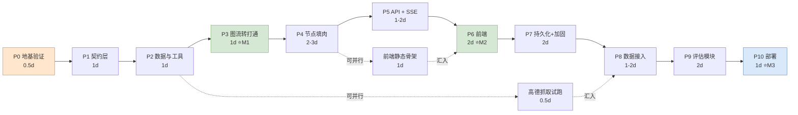

# 开发流程

> **怎么用这份文档**：干活时只看本文。每一步都写了四件事——**做什么 / 产出哪些文件 / 跑什么算通过 / 卡住了怎么办**。
> 需要查字段定义、阈值、公式这类契约细节时，翻 [方案设计.md](./方案设计.md)。
> 本文不含论证过程。想看「为什么这么设计」，答案都在方案设计里。

---

## 0. 全貌

### 依赖关系



**工期**：乐观 15 天，现实 20~24 天。**MVP（P0~P6）约 8 天**，做完浏览器里就能完整跑通。

### 三个里程碑

| 里程碑 | 位置 | 达成后你手上有什么 |
|---|---|---|
| **M1** | P3 结束 | **不接 LLM** 也能打印出完整执行轨迹，五道闸门行为正确。架构验证通过 |
| **M2** | P6 结束 | 浏览器里完整跑通「提问 → 追问 → 出方案 → 改一次 → 确认 → 看分」。可以录屏 |
| **M3** | P10 结束 | 公网链接 + 评估报告。可以写进简历 / 作品集 |

### 四条排序原则

不用背，出问题时回来对照：

1. **最贵的风险先验掉** —— 底层假设不成立会导致全面返工。用几十行脚本先炸掉它，别等写完 3000 行才发现。
2. **先图后肉** —— 图跑不通时，你分不清是图错了还是模型不听话，而这两类的排查手段完全不同。
3. **先纵向切通，再横向铺开** —— 一个节点从入口到出口跑通，好过五个节点各做 60%。
4. **契约先冻结** —— `state.py` / `edges.py` 是所有代码的地基，中途改动每个节点都要返工。

> ⚠️ 契约变更必须同步更新 [方案设计.md](./方案设计.md) 对应章节。文档和代码不一致 = 文档作废。

---

## P0 · 地基验证（0.5 天）

**目的**：在写第一行项目代码之前，确认方案建立在真实行为上，而不是你的记忆或旧教程上。

### 做什么

| # | 任务 | 产出 | 状态 |
|---|---|---|---|
| P0.1 | 建 `.venv`，装依赖并**钉死版本** | `.venv/`、`pyproject.toml` | ✅ 已完成 |
| P0.2 | 验证 `interrupt()` / checkpoint 语义 | `scratch/verify_interrupt.py` | ✅ 已完成 |
| P0.3 | **验证 LLM 的 tool_calls 格式** | `scratch/verify_tool_calls.py` | ✅ 已完成 |
| P0.4 | 实测结果回填文档 | 改 [方案设计.md](./方案设计.md) | ✅ P0.2 / P0.3 均已回填 |

### P0.2 结论（已完成，2026-09-23 / langgraph 1.2.7 / Python 3.12.1）

| # | 问题 | 实测结果 |
|---|---|---|
| Q1 | `interrupt()` 恢复后，节点里 interrupt **之前**的代码会不会再跑一次？ | ✅ **会**。节点函数体被进入 2 次 → 「纯函数」是**硬约束** |
| Q2 | 图被暂停时 `astream` 怎么结束？ | ✅ **不抛异常**，流里正常吐出 `{'__interrupt__': (Interrupt(...),)}` |
| Q3 | 靠什么判断图是否暂停？ | ❌ `.next` **不可靠**（二次 interrupt 时返回 `()`）；✅ `.interrupts` 全场景正确 |
| Q4 | 同一节点内连续两次 `interrupt()`？ | ✅ 可行，首次 resume 值**按索引重放** |

实测状态矩阵：

| 图状态 | `.next` | `.interrupts` | 判定 |
|---|---|---|---|
| 图跑完（到 END） | `()` | `()` | ✅ 两者都对 |
| 节点首个 interrupt 暂停 | `('confirm',)` | `(Interrupt,)` | ✅ 两者都对 |
| 节点**第二个** interrupt 暂停 | `()` ❌ | `(Interrupt,)` ✅ | ⚠️ **只有 `.interrupts` 对** |

脚本随时可重跑（不需 API key、不联网）。**升级 langgraph 版本后必须重跑**——这是全项目唯一一处依赖特定库版本行为的设计。

### P0.3 结论（已完成，2026-09-23 / openai 3.19.0 直连 / 模型 `deepseek-v4-flash`）

**为什么必须验**：选型是「OpenAI 兼容协议 + 配置驱动切模型」。有实测案例表明，DeepSeek 在部分场景下**不返回标准 `tool_calls` 字段，而是把调用意图吐成自家 DSML 格式的文本**。这种失败**不会报错**——LLM 把「我要查武侯祠」当正文讲给用户听，而不是真的去查数据。结果就是 `feasibility` 指标莫名掉分，而你查不出原因。

实测 5 个场景，**全部通过**：

| # | 场景 | 结果 |
|---|---|---|
| A | 非流式 · 单工具 | ✅ `finish_reason='tool_calls'`，1 条调用，`id`/`type`/`name`/`arguments` 齐全且为合法 JSON |
| B | **流式 · 单工具**（SSE 真实路径） | ✅ delta 按 `index` 拼装后与非流式结构完全一致 |
| C | 非流式 · 并行调用 | ✅ 单次响应返回 2 条，`id` 唯一非空，可按 `index` 配对 |
| D | 回灌 `assistant(tool_calls)` + `tool` 消息 | ✅ API 接受配对，模型基于工具结果给出文字回复 |
| E | `tool_choice="none"` + prompt 要求必须调工具 | ✅ 模型如实说明不能调用，**未出现文本化调用泄漏** |

**判定：不需要 tool_calls 归一化层。** `app/core/llm.py` 只保留 token / 耗时埋点。三条推论：

1. **归一化层可以不做**——省下的是「正则解析伪协议 + 伪造 id + 配套单测」一整块复杂度。方案设计 §13 目录结构里 `llm.py（含 tool_calls 归一化）` 的注释已按实测删掉。
2. **场景 D 的价值是反向的**：它证明「伪造 `dsml_0` 补回 messages」这条预案在**协议层可行**。将来换模型（GLM / 新版本）若真踩到 DSML，预案直接启用即可，不用重新设计。
3. **结论与模型名绑定。** 本次实测的是 `deepseek-v4-flash`。**换模型必须重跑**——一条命令，别省。

> ⚠️ **适用范围要说清楚**：`PLAN_TOOL_MODE=deterministic`（默认档）下工具由**节点代码确定性调用**，LLM 不参与 function calling（见 [方案设计.md](./方案设计.md) §4.2）。所以真正依赖 `tool_calls` 协议的不是那 4 个工具，而是三处：
> ① `requirement_collect` 的 `with_structured_output`（P4.1）
> ② `evaluate` 的 Judge 打分（P4.5）
> ③ `PLAN_TOOL_MODE=agent` 时的 LLM 自主调用（扩展路径）
>
> ①② 是 P4 的主路径，所以这次验证仍然是必要的地基。但它们**走的是 langchain `with_structured_output`，而不是裸 `tool_calls`**——这层包装底层是否稳定走 function_calling，本次并未实测，**留作 P4.0 的第一个待验项**，验法和本脚本同一套路。

**跑法**（唯一需要 API key 的 P0 任务；项目根目录 `.env` 配 `LLM_API_KEY` / `LLM_BASE_URL` / `LLM_MODEL`）：

```bash
.venv/Scripts/python.exe scratch/verify_tool_calls.py         # 全部 5 个场景
.venv/Scripts/python.exe scratch/verify_tool_calls.py A B C   # 只跑指定场景（D 会自动补跑 A）
```

---

## P1 · 契约层（1 天）

**目的**：把所有「接口形状」定死。**这是唯一一个完全不碰 LLM 就能把地基打完的阶段。**

### 做什么

| # | 任务 | 产出 |
|---|---|---|
| P1.1 | 项目骨架 | 目录结构 + `pyproject.toml`（ruff / pytest 配置）+ `.env.example` |
| P1.2 | `TravelState` 及全部子模型 | `app/graph/state.py` |
| P1.3 | 三个路由函数（纯函数） | `app/graph/edges.py` |
| P1.4 | 工具层契约 | `app/tools/base.py`（`ToolResult` + `POI` 等模型 + `POIBackend` Protocol） |
| P1.5 | 异常体系 | `app/core/exceptions.py` |
| P1.6 | 配置管理 | `app/core/config.py` |
| P1.7 | 单测 | `tests/test_state.py`、`tests/test_edges.py`、`tests/test_config.py` |

### 三个必须在 P1 定下的工程约定

**① 配置必须启动即校验（fail-fast）**

`Settings` 用 Pydantic 定义，`get_settings()` 用 `@lru_cache` 做单例。启动时校验：缺 `LLM_API_KEY`、POI 文件不存在、SQLite 路径不可写 → **直接启动失败并打印明确原因**，而不是等第一个用户请求才炸。

生产相关的开关要有硬校验，不留后门。比如：

```python
# AUTH_REQUIRED=true 但密钥太短 → 直接 raise，不给生产留后门
if settings.auth_required and len(settings.auth_token) < 16:
    raise ConfigError("AUTH_REQUIRED=true 时 AUTH_TOKEN 长度必须 >= 16")
```

**② 双模型槽位**

不要把模型写死成一个全局值。按**节点角色**分档，见 [方案设计.md](./方案设计.md) 的配置表：

| 配置项 | 用途 |
|---|---|
| `LLM_MODEL` | 主力模型：行程生成、反思审核 |
| `LLM_MODEL_CHEAP` | 便宜模型：需求收集（纯结构化抽取） |
| `LLM_JUDGE_MODEL` | 评估模型，配 `temperature=0` |

需求收集是简单任务，用便宜模型即可；行程生成和审核决定质量，用强模型。这一档配置能省下可观的成本，几乎零实现成本。

**③ `DEMO_MODE` 全局开关**

`.env` 里放一个 `DEMO_MODE=false`。置 `true` 时，**所有外部数据源被强制短路成 mock**，只留 LLM 一条真实依赖。

它解决两个具体问题：演示时不会因为某个 API key 过期/配额用完而当场翻车；评估时可复现（无网络抖动）。

### 验收

```bash
pytest -q && ruff check .
```

- 路由函数测试覆盖**全部分支**：`missing_fields` 空/非空、`review_passed` 真/假 × `retry_count` 未达/已达上限、`user_confirmed` 真/假
- reducer 行为有断言：`review_comments` 是**覆盖**语义，`node_trace` 是**累加**语义
- 配置校验有测试：故意缺 key，断言抛 `ConfigError`

> 🔑 **这一阶段的单测是整个项目性价比最高的投入。** 后面任何节点改动都靠这三个文件兜底。

---

## P2 · 数据与工具层（1 天）

**目的**：让「取数」先跑起来，**完全不依赖 LLM、不依赖真实数据集**。

### 做什么

| # | 任务 | 产出 |
|---|---|---|
| P2.1 | **手写 30 条假 POI** | `data/poi_clean.json`（成都 15 + 杭州 15） |
| P2.2 | `MockBackend` | `app/tools/backends/mock_backend.py` |
| P2.3 | 4 个工具 | `app/tools/{poi_query,opening_hours,distance,hotel_price}.py` |
| P2.4 | 后端分发 | `app/tools/registry.py` |
| P2.5 | 单测 | `tests/test_tools.py` |

### 假数据的三个要求

1. **必须是真实的城市和景点名**（武侯祠、宽窄巷子、西湖……），不要用 `POI_001`。LLM 对真实景点有先验知识，假名字会让 Prompt 调试结果失真。
2. **经纬度要大致真实**（从地图上抄），否则距离算出来你会怀疑代码写错了。
3. **故意留 3~5 条脏数据**：经纬度缺失、开放时间格式乱、价格为空。这样能提前暴露降级逻辑的问题。

### 工具层的四条铁律

**① 工具永不抛异常**

一律返回 `ToolResult(ok=False, error_code=...)`。上层拿到 `ok=False` 的策略是**降级而非中断**——距离算不出来就按直线估算并标注，酒店查不到就用默认均价。这样异常处理路径只有一条。

**② 归一化逻辑抽成纯函数，单独写单测**

外部数据源的返回结构**不可预测**（同一个工具可能返回 `{results:[]}` / `{return:[]}` / `{geocodes:[]}`，甚至一串 TextContent）。所以每个 backend 都要有 `_normalize_xxx(raw) -> POI` 这样的纯函数，把它拍平。

关键在于：**单测只测这些纯函数，不测网络**。用真实抓包 payload 当 fixture，覆盖每一种返回壳。

> 这是整个测试策略里性价比最高的一招：**测最脆弱的部分，而不是最难 mock 的部分**。零外部依赖，本地和 CI 都能跑。

**③ mock 数据里的 URL 必须指向真实可点开的页面**

不要写 `https://example.com/hotel/1` 这种死链。用真实搜索页拼参数：

```
https://www.amap.com/search?query=武侯祠&city=成都
https://kyfw.12306.cn/otn/leftTicket/init?fs=成都,杭州
```

演示时点进去能看到真东西，可信度完全不同。

**④ 不可用的数据要在返回值里打标记**

价格是估算的、区域不支持的，用**数据字段**标记，而不是靠 prompt 求 LLM 老实：

```python
if approx:
    for h in normalized:
        h["_approx_price"] = True          # 预算评估必须知道这是估算值
```

> 为什么这件事对我们特别重要：评估指标里有**预算符合度**。如果 LLM 把估算价当真实价报给用户，用户按虚价做决策，这个指标就是假的。用字段打标是**代码层强制**，比 prompt 可靠得多。

### 验收

- REPL 里 `poi_query.invoke({"city":"成都","tags":["人文"],"top_k":5})` 返回合理结果
- `estimate_distance` 算「武侯祠 → 宽窄巷子」返回 3~6 km（和地图对得上）
- 脏数据触发 `ToolResult(ok=False)` 而**不是抛异常**
- `pytest tests/test_tools.py` 全绿，且**不联网**

---

## P3 · 图流转打通（1 天）★ 里程碑 M1

> **整个项目最关键的一步。** 这一步做对了，后面都是体力活；做错了，后面每一步都在还债。

### 做什么

| # | 任务 | 产出 |
|---|---|---|
| P3.1 | 5 个节点**空壳**（每个 `return {}` + 一行埋点） | `app/graph/nodes/*.py` |
| P3.2 | 节点装饰器 `@traced_node` | `app/graph/nodes/decorators.py` |
| P3.3 | 建图 | `app/graph/builder.py`，`compile(checkpointer=MemorySaver())` |
| P3.4 | 路径驱动脚本 | `scratch/walk_graph.py` |
| P3.5 | 图行为单测 | `tests/test_graph.py` |

### P3.4 必须走通的 4 条路径

| 路径 | 输入构造 | 预期结果 |
|---|---|---|
| ① 一次通过 | 需求完整 → 审核通过 → 用户 approve | `node_trace = [req, plan, review, confirm, eval]`，`retry_count=0` |
| ② 触发机器重试 | 让 `self_review` 空壳返回 `review_passed=False` | `plan_generate` 出现 3 次（MAX=3），**第 4 次强制放行** |
| ③ 用户拒绝一次 | `resume={"action":"revise","feedback":"..."}` | `user_revision_count=1` 且 **`retry_count` 被清零** |
| ④ 追问一轮 | 需求缺失 → 再入图 | 图第一次跑完停在追问，第二次跑才进 `plan_generate` |

### 一条必须写进测试的红线

**反思审核节点不可被旁路。**

有真实案例：某同类项目在编排里加了一条「产出超过 80 字就直接结束」的优化规则，结果反思节点**从来没被执行过**，形同虚设，而且没人发现。

对策：在 `tests/test_graph.py` 里写一条**结构性断言**——正常路径下 `node_trace` 中**必须**出现 `self_review`，且它出现在 `user_confirm` 之前。任何「跳过节点」的优化都会被这条测试拦下。

> 推论：任何以「省 token / 提速」为名的旁路优化，都必须先证明它没有绕过质量把关环节。

### 验收

- 4 条路径全部符合预期，尤其是**路径 ③ 的 `retry_count` 清零**和**路径 ② 的降级放行**
- `node_trace` 能完整复原执行顺序（这是后面所有线上排查的基础）
- `tests/test_graph.py` 全绿，包含上面那条旁路断言

> 💡 这一步做扎实，P4 遇到「模型不听话」时你能立刻判断是模型问题还是图问题。

### P3 回填（2026-09-29 完成）

三处对上表字面要求的修正，都写进了方案设计 §4 / §5.2 / §7.6：

1. **「每个节点 `return {}`」不能照字面做。** 全返回空字典的话，四条路径一条都走不出来（`missing_fields` 永远是空的，图会一路冲进生成节点）。真正该空的是**需要 LLM 的那部分**；「必填项缺不缺」「问了几轮了」这类判断本来就是程序化的，P4 不会被它们挡住。所以 P2 的取舍是：**凡是「图怎么走」依赖的留着，凡是「答得对不对」依赖的留空并标 TODO。**
2. **`compile(checkpointer=MemorySaver())` 里的 `MemorySaver` 只是 `InMemorySaver` 的向后兼容别名**（langgraph 1.2.7 源码注释明说）。代码里用了本名，同一个类。
3. **`self_review` 空壳的默认行为定成「永远不通过」。** 上表说路径②要靠「让空壳返回 `review_passed=False`」来构造，实现时反过来：默认就是失败，想看通过的那条路用 `build_graph(overrides=...)`。这样 **G1 降级放行成了默认可见的行为**，不必靠注入才看得到 —— 而 G1 恰好是全图最容易写错的一处判断。

另有一项**新发现的 P4 阻塞项**：`plan_struct` 的 schema 全文未定义（§4.2 已记录）。它同时是 `plan_generate` 的第二输出段、`self_review` 全部程序化校验、§8.2 的 `estimated_cost` 三处的前置。P3 刻意不编占位形状。

---

## P4 · 节点填肉（2~3 天）

**目的**：逐个把空壳换成真实现。**一次只做一个节点，做完即测，不留半成品。**

### 做什么（按此顺序）

| # | 顺序 | 节点 | 依赖 | 关键点 |
|---|---|---|---|---|
| P4.0 | — | `app/core/llm.py`：LLM 工厂 + token/耗时埋点 | P0.3 ✅ | 归一化层**经实测不需要**（见 P0.3 结论）；~~先验 `with_structured_output` 走不走 function_calling~~ → ✅ **已验完，结论见下方「P4.0 回填」** |
| P4.1 | 1 | `requirement_collect` | P4.0 | 结构化抽取用 **delta 模式** |
| P4.2 | 2 | `plan_generate` | P4.0, P2 | **先只做确定性取数 + 生成** |
| P4.3 | 3 | `self_review` | P4.2 | **先只做 2 条规则**（时间冲突 + 预算） |
| P4.4 | 4 | `user_confirm` | P3 | `interrupt()` 实现 |
| P4.5 | 5 | `evaluate` | P4.2 | 三指标打分 |
| P4.6 | 6 | `validators/` 补齐剩余 5 条 + 语义审核 | P4.3 | |
| P4.7 | 7 | Prompt 全部落到 `.md` 文件 | 各节点 | |

### 六条纪律

**① 每个节点做完，立刻跑一次 P3.4 的路径回归**，确认没把图搞坏。

**② Prompt 不许写在 Python 字符串里** —— 全部放 `app/graph/prompts/*.md`。你会改很多次，写在字符串里 diff 出来是一坨。

**③ `self_review` 先写 2 条规则，再补到 7 条。** 规则一次性全写完最容易出错，而且它直接决定循环边界。先让最简单的两条跑通，验证「发现问题 → 回流 → 修好」这个闭环真的成立。

**④ 工具循环必须有终止保证。** 模型会反复调工具而不给结论。两道保险：

- 最后一轮强制 `tool_choice="none"`，逼它出文字；
- 循环外**再补一次**收尾调用：「请基于以上工具结果直接给出中文 markdown，不再调用工具」。

**⑤ 防 JSON 格式污染。** 在多轮结构化输出的上下文里，模型会**模仿格式**——把决策 JSON 当正文吐给用户。双保险：每个节点的 prompt 里硬写「绝对不要输出 JSON」+ 输出侧做剥壳清洗。

**⑥ 结构化输出解析要三层兜底。**

```
1) 直接 json.loads
2) 失败 → 提取 ```json 围栏内的内容再 parse
3) 再失败 → 逐字符扫描花括号配对深度，容忍前后废话
全部失败 → 不报错，把原文当结果用（降级而非崩溃）
```

> ⚠️ **P4.0 实测后这条的适用范围收窄了。** 走 `method="function_calling"` 时，
> 解析由 langchain 负责（`tool_calls` 里的 `arguments` 已是合法 JSON，P0.3 已证），
> **不经过「模型吐一段文本我们再从里面抠 JSON」这条路**，所以三层兜底用不上。
>
> 它仍然适用于**模型输出纯文本、而我们期待其中含结构化内容**的场合 —— 主要是
> §4.2 的双段输出里那个 `plan_struct` 段（若把两段合在一次调用里输出）。
> **不要因为有这条纪律就放弃 `function_calling`** —— 能靠协议约束的，别靠事后解析。

### 用数据字段驱赶 LLM 诚实

前面 P2 的工具层已经打了 `_approx_price` 这类标记。**在 prompt 里必须对应写死消费规则**：

> 当酒店条目带 `_approx_price=True` 时，必须在列表前加一行「**以下为近期参考报价**」。

同理，不支持的区域不要静默失败。让工具返回一条带说明的记录，把「该怎么跟用户说」也写在数据里：

```python
{"_unsupported_region": "东京",
 "_note": "本系统当前只覆盖国内目的地。请在回复中如实说明该限制，不要编造行程。"}
```

> 核心思路：**能用数据结构约束的，就不要加 prompt 字数。**

### 境外目的地必须显式处理

我们的 POI 库只覆盖国内。用户问「去东京玩 5 天」时，如果不处理，会走成：查不到 POI → 空候选 → **LLM 硬编景点** → 用户看不出来，指标崩掉。

对策（两层就够）：

1. **需求收集节点识别境外关键词**（维护一张国家/城市关键词表），命中则直接返回固定话术，不进入后续流程；
2. **prompt 里显式写禁区**，即使漏网也不让它编造。

这条同时对应评估集里的一个 case。

### 验收

- 每个节点有独立单测（用 **Mock LLM**，不真调 API）
- 一次真实端到端：给「国庆想去成都玩 3 天，2 个人，预算 5000，喜欢人文和美食」，能产出结构合理的行程，且 `self_review` **至少能抓到一次真实问题**

### P4.0 回填（2026-09-29 完成）

**第一个待验项验完了，结论是「待验项的写法本身就是错的」。** 全文见方案设计 §12.2，要点：

1. **`with_structured_output(Schema)` 照字面写 100% 400。** 它的默认 method 是 `json_schema`（走 `response_format`），而 DeepSeek 不认这个类型。必须显式 `method="function_calling"`。**「不传」和「显式传 json_schema」是同一个失败** —— 代码看起来没写错，只是没写全。
2. **`function_calling` 还要先关 thinking。** `deepseek-v4-flash` 默认开着 thinking，而它不支持被强制 `tool_choice` —— 而 `function_calling` 路径正是靠强制 `tool_choice` 逼模型走指定函数的。
3. **关 thinking 的参数形状只有一个是对的**：`extra_body={"thinking": {"type": "disabled"}}`。`{"enable_thinking": False}` 和 `{"chat_template_kwargs": {...}}` **会被服务端收下但不生效**，而且直接对话看不出来 —— 唯一试金石是拿 `function_calling` 去调。**不报错的失效比报错的失效难查一个量级**，与 P2 那个 `Protocol` 继承问题是同一型。
4. **thinking × 路径矩阵**：thinking ON 时 `with_structured_output(fc)` 不可用，但 `bind_tools(tool_choice="auto")` 可用。所以主力档若要保留推理能力，得走 `bind_tools` + 手动解析（`tool_calls` 格式标准，解析无负担）。
5. **`exclude_unset` 可以直接用** —— delta 模式的前提成立。而且 **prompt 里写不写「没提到的字段不要输出」没有差别**（两个变体各 10 次，都是 10/10 省略）。机制在 schema：模型全字段可空 → JSON Schema 的 `required` 为空 → 模型天然只填想填的。**推论：`TravelRequirementDelta` 必须全字段 `| None`，这是 delta 语义的载体，不是风格选择。**

**顺带验出来的两件事：**

- **「禁止编造」有效**：输入「想去成都玩」，5/5 只抽到 `destination`，没编 `days`/`travelers`/`origin`/`start_date` → §4.1 的追问逻辑会正常触发。
- **`start_date` 没有归一化**：输入「10月1号」返回的就是 `'10月1号'`，不是 `YYYY-MM-DD`。§4.1 实现要点 4 那句「由 LLM 结合注入的 `today` 换算」在现有 prompt 下不成立，P4.1 要补正反例或改代码层归一化。（**倾向前者**，理由见 §4.1。）

**对 P4.1 的直接影响**：`app/core/llm.py` 的工厂必须把「显式 `method="function_calling"`」和「关 thinking」**封在一处**，节点代码不许自己建 `ChatOpenAI` —— 否则这两件事会在每个节点各踩一遍，而且第二件踩了不报错。

**尚未验的**：主力档关不关 thinking（省 token vs 推理质量）。留给 P4.2，用同一份 prompt 对比两次生成的行程质量后再定 —— **不能因为省 token 就把主力档的推理关掉。**

**第二个待验项（`plan_struct` 的 schema）也定完了**，同样写进 §3.1：

- 三个模型 `PlanStruct` / `PlanDay` / `PlanItem` 落在 `app/graph/state.py`，`TravelState.plan_struct` 从裸 `dict` 收紧为 `PlanStruct | None`。
- **字段是从下游倒推的，不是发明的**：§4.3 七条校验 + §8.2 预算估算各自需要什么，就定什么。所以每个字段都有一位「主」。
- **五处刻意决定**：`kind` 里没有 `transport`（通勤由工具算，不让模型也报一个）；`poi_id` 由**代码回填**而非模型输出（幻觉检测退化成 `is None`）；只做结构校验不做内容校验（判据是「失败该走哪条处置」）；`nights` 派生且不等于 hotel 条目数；三个模型 frozen 防跨会话污染。
- **一个涉及行为的关键取舍 —— 时刻由 LLM 给，代码只校验不排期**：若改由代码按 `opening_hours` 排，§4.3 的闭馆冲突与时间冲突会**变成永远不可能触发的死代码**，而它们正是驱动 G1 回炉的两条。永远通过、看起来像验证的校验，比没有校验更糟。
- **新增 8 条测试 + `scratch/mutate_p4.py`（9 条变异，9/9 全被抓住）。**

> ⚠️ **变异①（其实是第⑤条）抓出了我自己的一个弱断言**：`PlanStruct()` 只走缺省路径，而
> **Pydantic 默认 `validate_default=False` —— 缺省值不参与校验**。所以「加个 `min_length=1`」
> 这种变异对 `PlanStruct()` 完全无效，测试绿着通过。改成显式 `PlanStruct(days=[])` 才抓住。
> **写「内容不该被校验」这类否定式断言时，必须把值显式传进去** —— 只断缺省路径等于没断。

---

---

## P5 · API + SSE（1~2 天）

### 做什么

| # | 任务 | 产出 |
|---|---|---|
| P5.1 | FastAPI 应用 | `app/main.py`（lifespan + 静态托管 + 全局异常处理 + `/api/health`） |
| P5.2 | 会话路由 | `app/api/routes_session.py` |
| P5.3 | SSE 封装 | `app/api/sse.py` |
| P5.4 | 核心接口 | `app/api/routes_chat.py` |
| P5.5 | **resume 模式判定** | 按 [方案设计.md](./方案设计.md) §7 实现——**用 `.interrupts`，不是 `.next`** |
| P5.6 | interrupt 收尾 | 检查 chunk 里的 `__interrupt__` 键，**不要写 `except GraphInterrupt`** |
| P5.7 | 心跳 + 断连取消 | 15s ping；`request.is_disconnected()` |
| P5.8 | 限流 | 进程内滑动窗口 |

### 三个容易翻车的点

**① SSE 的响应头缺一不可**

```
Content-Type: text/event-stream; charset=utf-8
Cache-Control: no-cache, no-transform
Connection: keep-alive
X-Accel-Buffering: no        ← 少了这个，Nginx 会把流攒成一坨
```

**② 可观测性代码自身的异常必须吞掉**

日志 / 埋点 / 追踪这类代码是**旁路**，它自己出错绝不能影响业务流。所有 helper 用 try/except 包住，注释写明原因。写日志失败导致用户请求 500 是最没必要的事故。

**③ 日志脱敏**

任何连接串、密钥、token 进日志前必须过一层脱敏函数：

```python
def safe_dsn(dsn: str) -> str:
    """user:pass@host → user:***@host"""
```

配套已有约束：`LLM_API_KEY` 永不进日志；用户输入超 500 字符截断。

> 如果后续做 MCP 对照实验（见 §阶段 4），注意一个已验证的坑：**长连接 + anyio cancel scope 跨 task 会让 SSE 流永久挂死**。解法是 MCP 客户端每次调用建短连接（`AsyncExitStack` 每次新建），牺牲连接复用换正确性。

### 验收（用 curl，不要用浏览器）

```bash
curl -N -X POST localhost:8000/api/chat/stream \
  -H 'Content-Type: application/json' \
  -d '{"thread_id":"t1","message":"国庆想去成都玩3天"}'
```

- 事件**逐条吐出**，不是攒一堆一次性出来（攒一堆 = 缓冲没关或 SSE 封装有问题）
- 能看到 `node_start → token → node_end → ... → interrupt → done` 的完整序列
- 中途 `Ctrl+C` 断开，服务端日志显示任务被取消（不是继续跑完）

> 🔑 **先用 curl 把 SSE 验透，再接前端。** 把「协议对不对」和「前端解析对不对」分开修。

---

## P6 · 前端（2 天）★ 里程碑 M2

### 做什么

| # | 顺序 | 任务 |
|---|---|---|
| P6.1 | 1 | Tailwind CLI 构建链路（产出 `styles.css`，**不用 Play CDN**） |
| P6.2 | 2 | `index.html` 静态骨架：三栏布局，先塞假数据 |
| P6.3 | 3 | **`sse.js` 手工 SSE 解析器** |
| P6.4 | 4 | 对话流 + 流式打字机 |
| P6.5 | 5 | 方案区：Markdown 渲染 + 审核意见卡片（渲染后过白名单清洗） |
| P6.6 | 6 | 底部确认栏（`interrupt` 时出现）：approve / revise |
| P6.7 | 7 | 刷新恢复（`localStorage` + `GET /api/session/{tid}`） |
| P6.8 | 8 | PWA：`manifest.json` + `sw.js`（sw **不缓存** `/api/*`） |

### P6.3 是前端唯一的高风险项

- **EventSource 只支持 GET**，发不了 JSON body 和 resume 载荷 → **必须**用 `fetch` + `ReadableStream` 手工解析
- `TextDecoder` 必须带 `{stream: true}`，否则**中文会在 chunk 边界被切碎成乱码**（这个 bug 必现，且症状诡异）
- 按 `\n\n` 切事件块时，**最后一个不完整块要留在缓冲区**等下一个 chunk，不能丢弃
- 每个事件的解析单独 try/catch，**一条坏了不能让整个流断掉**

### 验收

- 浏览器完整走完：提问 → 追问 → 出方案 → 看审核意见 → 提交修改 → 再出方案 → 确认 → 看评估报告
- 中文流式输出**无乱码**
- 中途刷新能恢复到确认栏
- 手机浏览器打开可用（DevTools 设备模拟即可）

---

## P7 · 持久化与加固（2 天）

### 做什么

| # | 任务 | 产出 |
|---|---|---|
| P7.1 | `AsyncSqliteSaver` 接入 | `app/services/checkpoint.py` + lifespan 管理 |
| P7.2 | SQLite 参数 | WAL + `busy_timeout` |
| P7.3 | 会话清理任务 | 启动时 + 每 6h，删 30 天前的 thread |
| P7.4 | 校验规则补齐 | 闭馆 / 距离 / 路线折返 / 幻觉 POI / 完整性 |
| P7.5 | 四道闸门 G1~G4 接通 | G1/G2/G3 的实现在 P1.3 与 P5 已落，这里补端到端联调。**G5 已放弃**，见方案设计 §5.2 |
| P7.6 | 日志体系 | contextvar 注入 `session_id`/`node` + LLM 埋点 |
| P7.7 | 异常分层 | 按 [方案设计.md](./方案设计.md) 的异常表落地 |

### SQLite 三个必踩的坑

| 坑 | 对策 |
|---|---|
| **`created_at` 只到秒精度**，同秒插入排序有歧义 | 排序 / 截断一律用**自增 `id`** 作唯一排序键 |
| **默认不强制外键** | 显式 `PRAGMA foreign_keys=ON` |
| **`create_all` 不会 ALTER 已存在的表**，加列在老库上静默失效 | 启动时 `PRAGMA table_info` 探测列是否存在，缺则 `ALTER TABLE ADD COLUMN` |

> 我们后面要加 `user_profile` 表，第三条一定会遇到。

### 验收

- **重启服务后，旧会话仍能继续**（这是 Checkpointer 唯一有价值的验证）
- 手工注入异常：LLM 超时、POI 数据损坏、工具返回 `ok=False` → **服务不崩，能降级出结果**
- 日志里能按 `session_id` 串起一次完整会话的全部节点耗时

---

## P8 · 数据接入（1~2 天）

> 可与 P4/P6 并行。`P8.0 高德抓取试跑` 是最早可以并行做的事。
>
> **数据源决策见 [方案设计.md](./方案设计.md) §6.6**：主路径是「高德离线抓取」，ChinaTravel 降级为备选。因此本阶段**没有"数据集确认"这个前置阻塞项**——抓取脚本能不能跑通，试一次就知道。

### 做什么

| # | 任务 | 产出 |
|---|---|---|
| P8.0 | **高德抓取试跑**（0.5d，可提前） | 拿 API Key，抓 1 个城市 20 条 POI，确认字段齐全度 |
| P8.1 | 抓取脚本 | `scripts/fetch_poi_from_amap.py` |
| P8.2 | 共用清洗规则 | `scripts/clean_common.py` |
| P8.3 | 门票价格人工补齐 | `data/manual/ticket_price.csv` |
| P8.4 | 抽检报告 | `data/preprocess_report.json` |
| P8.5 | 替换 `poi_clean.json` + 回归 | 跑一遍 P4 的端到端，对比质量 |
| P8.6 | （备选）ChinaTravel 路径 | `scripts/preprocess_poi.py`，**仅当抓取受阻时** |

### 验收

- 3~5 个城市，每城 ≥ 40 条带经纬度的景点
- **门票价格覆盖率 > 60%**（主要景点必须有人工补齐的票价，否则预算指标算不准）
- 开放时间解析成功率 > 80%（低于这个说明正则要补）
- **清洗规则有单测**（去重 / 缺失值 / 正则三块），且**跑两次结果完全一致**

> ⚠️ 抓取是一次性动作，产物 `poi_clean.json` 进版本库。**运行时绝不访问高德**——这是「程序化指标完全可复现」的前提。抓取时请留意高德的服务条款与配额。

---

## P9 · 评估模块（2 天）

### 做什么

| # | 任务 | 产出 |
|---|---|---|
| P9.1 | 三指标计算 | `app/services/evaluator.py` |
| P9.2 | Judge Prompt | `temperature=0` + 写死 Rubric + 2 个 few-shot |
| P9.3 | 50 条测试集 | 手写 10 种子 → LLM 扩样 → 人工校验 |
| P9.4 | 批量评估 | `eval/run_eval.py` |
| P9.5 | **跑基线** | 记录 v1 分数，作为后续对照锚点 |

### 测试集必须包含的三类特殊 case

除常规难度分层外，这三类必须各占至少一条：

| 类型 | 样例 | 考察什么 |
|---|---|---|
| **境外目的地** | 「想去东京玩 5 天」 | 是否正确拒答/说明限制，而不是编造行程 |
| **预算极紧 / 明显不够** | 「想去 5 个城市，预算 500」 | 是否诚实告知，而不是硬凑一个走不通的方案 |
| **估算价格标注** | 涉及酒店的任意 case | 预算报告里是否区分了实价与估算价 |

### 验收

- `run_eval.py` 一次跑完 50 条不崩，产出汇总报告
- 报告头部记录模型版本 / Prompt 版本 / git commit
- 同一个 case 连跑 3 次，程序化指标（`feasibility` / `budget_fit`）**完全一致**（不一致 = 有随机性泄漏进来）

> 🔑 **P9.5 的基线是整个项目最有价值的产出之一。** 之后每次换模型、改 Prompt，跑一遍就能量化回答「变好了还是变差了」，而不是靠感觉。

---

## P10 · 部署（1 天）★ 里程碑 M3

### 做什么

| # | 任务 | 产出 |
|---|---|---|
| P10.1 | `Dockerfile` | 单 worker，`python:3.11-slim` + `HEALTHCHECK` |
| P10.2 | `docker-compose.yml` | volume 挂 `/data`；重依赖挂 `profiles` |
| P10.3 | 反代 + HTTPS | Caddy（推荐）或 Nginx，**SSE 透传配置** |
| P10.4 | 公网验收 | 逐项过下面的清单 |
| P10.5 | `README.md` | 快速开始 + 架构图 + **公网链接** |

### 两个工程细节

**① Dockerfile 不 COPY 测试和脚本**

只 COPY 运行必需的东西（`app/`、`data/poi_clean.json`、`eval/`）。`tests/`、`scripts/`、`docs/` 不进镜像，层缓存更快、镜像更小。

**② 可选重依赖挂 `profiles`**

如果后续接了本地的 MCP server 之类，别让它们进默认启动路径：

```yaml
services:
  app:
    build: .
    ports: ["8000:8000"]
  xhs-mcp:
    image: ...
    profiles: ["xhs"]        # 默认不启动，需要时 docker compose --profile xhs up
```

### 公网访问方案（三选一）

| 方案 | 成本 | 适用 | 要点 |
|---|---|---|---|
| **云服务器 + Caddy**（推荐） | ~￥60/月 | 长期可用 | Caddy 一行配置自动签 HTTPS；默认透传流式响应 |
| **Fly.io / Render** | 免费额度 | 作品集演示 | 需挂 persistent volume；注意免费实例休眠会断开 SSE |
| **内网穿透（frp / cloudflared）** | 免费 | 临时演示 | 仅用于给他人看，注意本机别休眠 |

### 验收清单

- [ ] `/api/health` 返回 `llm_ok=true`、`poi_count > 0`
- [ ] 首次对话到出草稿的**首字节时间 < 3s**
- [ ] HITL 中断后，刷新页面能恢复到确认栏
- [ ] 服务重启后，旧会话仍可继续
- [ ] 手机浏览器打开、添加到主屏幕后全屏可用
- [ ] `.env` 未进版本库，`git log` 中无密钥

---

## 附录 A · 时间不够时怎么砍

**从后往前砍，不要从中间砍。**

| 优先级 | 内容 | 砍掉的影响 |
|---|---|---|
| 🔴 必做 | P0 → P1 → P2 → P3 → P4 → P5 → P6 | 砍任何一步项目就不成立 |
| 🟡 强烈建议 | P8 数据接入、P9 评估 | 项目还能跑，但说服力掉一档 |
| 🟢 可砍 | P7 的清理任务、前端 PWA、限流 | 功能完整度下降，不影响演示 |
| ⚪ 可砍 | P10.3 HTTPS（用内网穿透代替）、多城市、导出功能 | 演示可用性略降 |

**MVP = P0 ~ P6，约 8 天。** 做完浏览器里就能完整跑通。

---

## 附录 B · 三个最容易走偏的地方

**① 图还没跑通就开始调 Prompt**

症状：`self_review` 老是不通过，你反复改 Prompt，越改越糟。
真相：可能是 `review_passed` 的判定逻辑写错了，或者 `retry_count` 没清零导致一进循环就被强制放行。
对策：P3 的空壳图必须先把 4 条路径跑通。之后每次调 Prompt 前，先确认图流转是对的。

**② 过早引入真实数据和真实 API**

症状：花两天清洗数据，发现字段跟方案里写的对不上，回头改 `state.py`。
对策：P2 的手写假数据就是为了避免这个。数据形状在手写阶段定型，P8 只是换个数据源。

**③ 前端和 SSE 同时调**

症状：页面上什么都不出来，不知道是 SSE 协议错了还是解析器写错了。
对策：P5 用 curl 把 SSE 验透，P6 再写解析器。两边分开修。

---

## 附录 C · 每阶段结束时的固定动作

1. **跑全量测试**：`pytest` + `ruff check .`
2. **提交 commit**：消息格式 `feat(P3): 图流转打通 + 4 条路径回归`
3. **更新文档**：若偏离了 [方案设计.md](./方案设计.md)，同步改对应章节
4. **记录阻塞项**：没解决的问题写进 commit message，别留在脑子里

---

## 附录 D · 一页纸速查

```
P0  验 interrupt 语义 + 验 tool_calls 格式 + 钉版本
                                    →  两个脚本都跑通，文档与实测一致
P1  state / edges / 配置 / 异常 / 单测
                                    →  pytest 绿，路由分支全覆盖，配置缺参即启动失败
P2  手写 30 条假 POI + 4 个工具
                                    →  REPL 能查到景点、能算距离，脏数据走 ToolResult
P3  空壳图 + 4 条路径回归    ⭐M1   →  不接 LLM 也能画出完整轨迹，反思节点不可旁路
P4  逐节点填肉（先 2 条校验规则）    →  一句自然语言能出合理行程，审核能抓到真问题
P5  FastAPI + SSE（先用 curl 验）    →  事件逐条吐，中断能取消，日志脱敏
P6  前端 + 手工 SSE 解析器   ⭐M2   →  浏览器完整走通，中文不乱码
P7  SQLite + 校验补齐 + 五道闸门     →  重启不丢会话，异常不崩
P8  高德离线抓取 + 清洗              →  3~5 城，票价覆盖率 > 60%，跑两次结果一致
P9  评估模块 + 50 条测试集 + 基线    →  程序化指标完全可复现
P10 Docker + 反代 + 公网     ⭐M3   →  首字节 < 3s，清单全过
```

---

*本文是实现顺序的唯一依据。任务拆分若需调整，先改本文，再动代码。*
