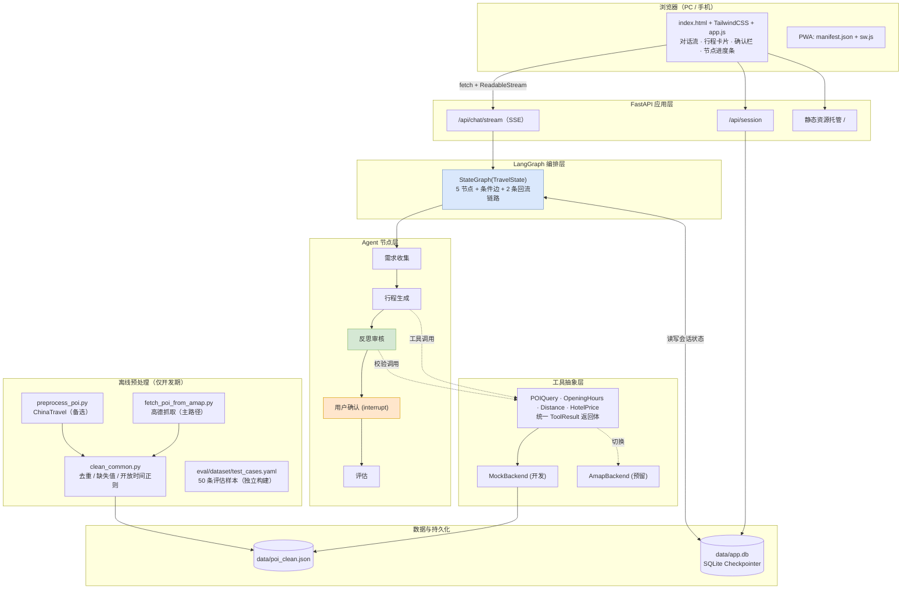
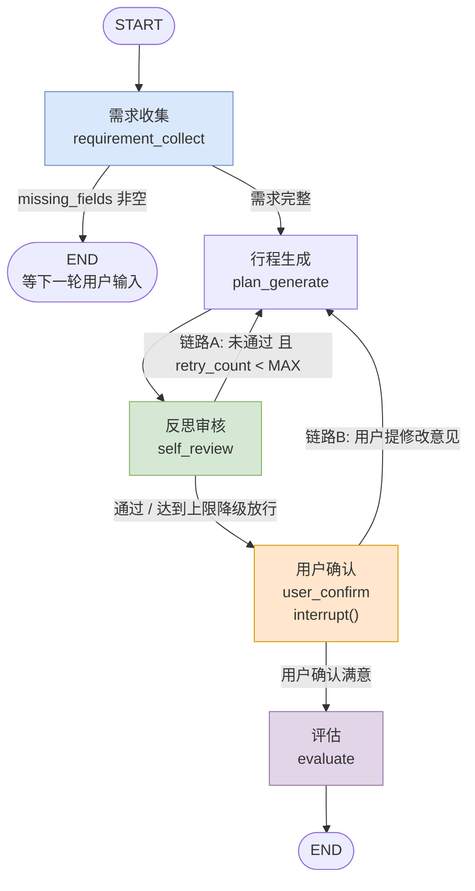

# 方案设计 · 契约手册

> **怎么用这份文档**：这是**查阅用的契约手册**，不是教程。写代码时按需翻对应章节，找字段定义、阈值、公式、接口形状。
> 「现在该做什么、按什么顺序」看 [开发流程.md](./开发流程.md)。
> 本文只放**结论和契约**，不放论证过程。改了契约必须改这里，代码是照着本文写的。

---

## 1. 定位与技术栈

**一句话**：可部署的 Web 应用，公网一个链接打开即用。用户用自然语言说「国庆想去成都玩 3 天，2 个人，预算 5000，喜欢人文和美食」，系统自动完成：多轮补齐需求 → 调工具取数生成行程 → 自我反思校验并回炉 → 人在回路确认 → 输出方案 + 评估报告。

### 展示的七项能力

| 能力 | 载体 |
|---|---|
| LangGraph 状态图编排 | `StateGraph` + 条件边 + 循环 |
| 多 Agent 协作 | 5 个节点，共享同一全局 `TravelState` |
| 工具调用 | 4 个工具 + 抽象后端，Mock / 真实 API 可切换 |
| Self-Reflection | `self_review` 节点 + 自动回炉 + 重试阈值 |
| Human-in-the-Loop | `interrupt()` 暂停 + `Command(resume=)` 恢复 |
| 流式输出 | `astream` 多模式 + SSE |
| 方案评估 | 程序化指标（60%）+ LLM-as-Judge（40%） |

### 技术栈

| 层 | 选型 |
|---|---|
| 语言 | Python >= 3.11 |
| 编排 | langgraph |
| LLM | langchain-core + langchain-openai（`ChatOpenAI` 兼容任意 OpenAI 协议服务） |
| 建模 | pydantic v2 |
| 配置 | python-dotenv |
| 日志 | logging（内置）+ contextvars |
| Web | fastapi + uvicorn |
| 持久化 | langgraph-checkpoint-sqlite |
| 离线预处理 | pandas / re / pyyaml（**仅开发期**，运行时不加载） |
| 质量 | ruff / pytest |

### 明确不做

| 不做 | 原因 |
|---|---|
| 向量数据库 / RAG | POI 是结构化数据，按 `city` / `type` / `rating` 过滤排序即可。RAG 反而引入召回噪声 |
| Redis | 会话状态交给 Checkpointer；限流用进程内内存 |
| LangServe | 只服务自研前端，手写接口对 SSE 更可控 |
| 桌面 exe / 原生 App | 产品形态是 Web，一个 URL 覆盖 PC 与手机；用 PWA 换壳 |
| 前端框架（Vue/React） | 只有「对话流 + 行程卡片 + 确认栏」三块，引入构建链收益为负 |

---

## 2. 架构

### 2.1 分层



### 2.2 状态图



### 2.3 两条回流链路

- **链路 A｜机器自省环**：`self_review → plan_generate`。程序化校验失败触发，计入 `retry_count`，上限 `MAX_REVIEW_RETRY`（默认 3）。
- **链路 B｜用户反馈环**：`user_confirm → plan_generate`。用户主动提意见触发，计入 `user_revision_count`，**不计入机器重试次数**，上限 `MAX_USER_REVISION`（默认 5）。

两条链路互不污染计数：进入链路 B 时 `retry_count` **清零**，机器重新获得完整自省预算。

---

## 3. TravelState 契约

### 3.1 完整模型

```python
# app/graph/state.py
from operator import add
from typing import Annotated, Literal

from langgraph.graph.message import add_messages
from pydantic import BaseModel, Field

# ---- 字面量别名：集中定义，供节点 / 校验器 / prompt 渲染共用 ----
ReviewType = Literal["time_conflict", "distance", "budget", "closed",
                     "routing", "completeness", "other"]
Severity = Literal["error", "warn"]          # error 阻塞通过；warn 仅建议优化
Pace = Literal["relaxed", "moderate", "intense"]
Transport = Literal["public", "taxi", "drive", "walk"]
Stage = Literal["collecting", "planning", "reviewing", "awaiting_user",
                "evaluating", "done", "failed"]


class TravelRequirement(BaseModel):
    """结构化出行需求。全部字段可空，由需求收集节点逐轮填充。"""
    origin: str | None = None               # 出发城市
    destination: str | None = None          # 目的地城市
    start_date: str | None = None           # 出发日期 ISO8601 (YYYY-MM-DD)
    days: int | None = None                 # 行程天数
    budget: float | None = None             # 总预算（元）
    travelers: int | None = None            # 出行人数
    preferences: list[str] = Field(default_factory=list)  # 人文/美食/自然/亲子/夜生活
    pace: Pace | None = None
    transport: Transport | None = None


class ReviewComment(BaseModel):
    """单条反思审核意见。"""
    type: ReviewType
    severity: Severity
    day_index: int | None = None            # 问题落在第几天（0-based），全局问题为 None
    detail: str                             # 问题描述（喂回 LLM 时作为约束）
    suggestion: str | None = None


class EvalResult(BaseModel):
    """评估报告。分数 0-100，越界值由 §8 的计算代码钳制并记 warn，本模型不校验。"""
    requirement_match: float                # 需求匹配度（LLM-as-Judge）
    feasibility: float                      # 行程可行性（程序化）
    budget_fit: float                       # 预算符合度（程序化）
    total_score: float                      # 加权总分
    passed: bool
    dimensions_detail: dict = Field(default_factory=dict)
    judge_reason: str = ""
    estimated_cost: float | None = None
    elapsed_ms: int = 0


# ConfirmInput（user_confirm 的 resume 值契约）也定义在本文件，见 §4.4


class TravelState(BaseModel):
    # ---------- 会话标识 ----------
    session_id: str = ""

    # ---------- 输入 ----------
    user_query: str = ""                    # 本轮用户原始输入（每轮覆写）
    user_requirement: TravelRequirement = Field(default_factory=TravelRequirement)
    missing_fields: list[str] = Field(default_factory=list)
    pending_question: str | None = None     # 非空 → 本轮以追问结束

    # ---------- 产物 ----------
    draft_plan: str = ""                    # 行程草稿（Markdown）
    plan_struct: dict = Field(default_factory=dict)   # 机器可读的每日点位顺序
    review_comments: list[ReviewComment] = Field(default_factory=list)  # 覆盖语义
    review_history: Annotated[list[list[ReviewComment]], add] = Field(default_factory=list)
    review_passed: bool = False
    user_feedback: str = ""                 # 覆盖语义
    user_confirmed: bool = False
    final_plan: str = ""
    eval_result: EvalResult | None = None

    # ---------- 循环控制 ----------
    retry_count: int = 0                    # 链路 A
    user_revision_count: int = 0            # 链路 B
    ask_round: int = 0                      # 追问轮数（G3）
    stage: Stage = "collecting"
    error: str | None = None

    # ---------- 轨迹 ----------
    messages: Annotated[list, add_messages] = Field(default_factory=list)
    node_trace: Annotated[list[str], add] = Field(default_factory=list)

    # 另有派生视图 unresolved_errors（@property，不是字段），见下
```

> 类型写法用 `str | None` 而非 `Optional[str]` —— ruff 的 UP045 规则强制，
> Python 3.11+ 的现代写法，语义完全相同。

**派生视图（不是字段）**

| 名称 | 定义处 | 说明 |
|---|---|---|
| `unresolved_errors` | `TravelState.unresolved_errors`（`@property`） | `review_passed=False` 时，`review_comments` 中 severity 为 `error` 的子集。**故意不设独立字段**：`review_comments` 是覆盖语义，任何时刻恰好持有本轮全部意见，再存一份 error 子集就会产生第二份事实来源，迟早与主列表漂移。§4.4 的 interrupt 载荷、§5.2 的 G1 闸门、§10 的 `interrupt` 事件直接用它 |

> **待定模型**：`TravelRequirementDelta`（§4.1 实现要点 1）**暂不定义** ——
> 其精确形状取决于 `with_structured_output` 的实测结果，该项已列为 P4.0 第一个待验项（见 §12.1）。

### 3.2 字段生命周期

| 字段 | 写入者 | 读取者 | 说明 |
|---|---|---|---|
| `user_query` | API 层（每轮注入） | `requirement_collect` | 覆盖语义。节点消费后返回 `""` 清空 |
| `user_requirement` | `requirement_collect` | 全部下游 | **增量合并**：本轮抽到的覆盖旧值，未抽到的保留 |
| `missing_fields` | `requirement_collect` | 条件边、前端 | 为空 → 可进入生成 |
| `pending_question` | `requirement_collect` | API / 前端 | 非空 → 本轮追问结束，图终止在 END |
| `draft_plan` | `plan_generate` | `self_review` / `user_confirm` | 每次重生成整体覆盖 |
| `plan_struct` | `plan_generate` | `self_review` / `evaluate` | 机器校验的输入，与 `draft_plan` 同源 |
| `review_comments` | `self_review` | `plan_generate` / 前端 | **覆盖语义**，避免历史包袱串味 |
| `review_history` | `self_review` | 评估 / 调试 | 累加，保留每轮审核快照，用于分析收敛性 |
| `user_feedback` | `user_confirm` | `plan_generate` | 覆盖语义，被消费后清空 |
| `retry_count` | `self_review` | 条件边 | 链路 A 计数 |
| `user_revision_count` | `user_confirm` | 条件边 | 链路 B 计数，独立上限 |
| `ask_round` | `requirement_collect` | 条件边 | 超过 G3 上限则填默认值放行 |
| `node_trace` | 各节点（装饰器统一追加） | 日志 / 调试 | 形如 `["requirement_collect#1", ...]` |
| `messages` | 各节点 | 各节点 | 喂 LLM 前做窗口裁剪 |

### 3.3 Reducer 决策

| 语义 | 字段 | 理由 |
|---|---|---|
| **覆盖** | `draft_plan`、`review_comments`、`user_feedback`、`retry_count`、`stage` | 代表「当前轮次的最新事实」。累加会让上一轮的问题清单污染下一轮，导致 LLM 反复修已修好的问题 |
| **累加** | `messages`（`add_messages`）、`review_history`、`node_trace`（`operator.add`） | 审计 / 上下文轨迹，需要历史 |

> ⚠️ `Annotated[list, add]` 的字段**无法通过返回 `[]` 清空**。凡是需要「清空」的字段一律不用 add reducer，需要历史时另开 `*_history` 字段。

---

## 4. 节点规格

所有节点统一签名 `def node(state: TravelState, config: RunnableConfig) -> dict`，返回**状态增量字典**（只返回本节点修改的字段）。统一由 `@traced_node("node_name")` 包裹，负责计时、日志、`node_trace` 追加、异常兜底。

**P3 落实的两处修正**（2026-09-29）：

**① 包裹动作在 `builder.py`，不写成节点上的装饰器。** §4 这句「统一由 `@traced_node` 包裹」原本可以读成「每个节点模块里加一行 `@`」。实现时改成了**注册时统一包裹**，因为 `build_graph(overrides=...)`（P3 引入，见下）要求替身节点**也被追踪**：如果装饰器长在节点模块上，替身就得在测试里自己再包一层，漏一处就静默丢轨迹 —— 而丢的恰好是被替换的那段，也就是最需要轨迹的时候。放在注册点，则「进了图的节点必然被追踪」由构造过程保证。

**② 异常兜底必须先放行 `GraphBubbleUp`。** 这是 P3 实测踩出来的坑，代价不小：`interrupt()` 靠**抛 `GraphInterrupt`**（`Exception` 的子类）来暂停图，所以最自然的 `except Exception` 会把它当成节点故障吞掉。实测后果不是「暂停失败」，而是**暂停被换成死循环** —— 节点返回错误状态、`user_confirmed` 仍是 `False`、路由判成「用户要改」把人送回生成节点，转一圈再来一次，最后以 `GraphRecursionError`（撞 G4）收场。日志里每一次都只写着「节点执行失败」，没有一行提到 interrupt。

正确的写法是 `except GraphBubbleUp: raise` 放在 `except Exception` **之前**。`scratch/mutate_p3.py` 的变异① 验证过：删掉这一行，8 条测试同时变红。

**`overrides` 是 P3 引入的建图参数**，`build_graph(checkpointer, overrides={节点名: 替身})`。它**只换节点的行为，不换图的连线** —— 所以硬红线 #3 的结构断言（`self_review` 不可旁路）不受它影响，`test_overrides_do_not_change_topology` 守着这一点。P3 的四条路径里有三条需要它：默认空壳审核永远不通过，另两条路径得把审核换成会通过的实现。

### 4.1 `requirement_collect` 需求收集

| 项 | 内容 |
|---|---|
| 输入 | `user_query`、`user_requirement`（合并基线）、`messages`、`ask_round` |
| 输出 | `user_requirement`（合并后）、`missing_fields`、`pending_question`、`user_query=""`、`ask_round+1`、`stage` |
| 出口 | `missing_fields` 为空 → `plan_generate`；否则 → `END` |
| 模型档 | **便宜模型**（纯结构化抽取） |

**实现要点**

1. 用结构化输出抽取 `TravelRequirementDelta`，Prompt 给**当前已收集的需求 JSON** + 本轮输入，要求**只输出新增/修改的字段**。用 delta 而非全量，避免 LLM 把已有字段抹掉。

   > ⚠️ **不能照字面写 `llm.with_structured_output(TravelRequirementDelta)` —— 在 DeepSeek 上 100% 400。** P4.0 实测（§12.2）：默认 method 是 `json_schema`，服务端不支持。正确写法：
   >
   > ```python
   > chain = prompt | llm.with_structured_output(TravelRequirementDelta,
   >                                             method="function_calling")
   > ```
   >
   > 且该 `llm` **必须已关掉 thinking**（`extra_body={"thinking": {"type": "disabled"}}`），否则报 `Thinking mode does not support this tool_choice`。两处都封在 `app/core/llm.py` 的工厂里，**节点不自己建 `ChatOpenAI`**。
   >
   > **`TravelRequirementDelta` 的每个字段都必须是 `X | None`。** 这不是风格选择 ——
   > 它决定了 delta 模式能不能成立：全字段可空 → function calling 的 JSON Schema 里
   > `required` 为空 → 模型天然只填它想填的字段 → `model_dump(exclude_unset=True)`
   > 的合并语义成立。**把任一字段改成必填，就等于让服务端逼模型编一个值出来。**
   > （P4.0 实测：10/10 次模型都只返回本轮提到的字段，10/10 次都没带上 `destination`。）
2. **必填字段**：`destination`、`days`、`travelers`。其余缺失不阻塞，用默认值兜底并在行程中标注假设（`start_date` 缺省取最近一个周末，`budget` 缺省按人均 500/天估算）。必填项缺失超过 `MAX_ASK_ROUNDS` 轮时也降级放行。
3. **追问话术**由 LLM 生成自然中文问句，不要模板化成「请提供 days 字段」。同时写入 `messages`。
4. **日期归一化**：`start_date` 统一转 `YYYY-MM-DD`；「国庆」这类相对表述由 LLM 结合 prompt 中注入的 `today` 换算；换算不确定时按缺失处理并追问。

   > ⚠️ **P4.0 实测：这件事光靠现有 prompt 做不到。** 输入「10月1号」实测返回的 `start_date` 就是 `'10月1号'`，**没有归一化**（§12.2）。所以 P4.1 必须补上二者之一：
   >
   > - prompt 里注入 `today` 并给出**正反例**（「10月1号 → 2026-10-01」，反例「→ 10月1号」）；
   > - 或代码层做归一化。
   >
   > **倾向前者**：归一化需要知道 `today`，而节点若同时把 `today` 用在 prompt 和代码里，就是两份事实来源。让 LLM 一次算对，代码只做**格式校验**（不是 ISO 就按缺失处理并追问）——这样归一化失败退化成「多问一轮」，而不是「带着脏日期往下走」。
5. **境外拦截**：识别到境外目的地关键词时，直接返回固定话术，**不进入后续流程**。

**Prompt 要点**：角色是旅行顾问；明确「必填三项，其余可选」；不要在本步推荐景点或输出行程；无把握的字段留 null，**禁止编造**（编造出发地会导致后续距离计算全错）；**绝对不要输出 JSON**。

### 4.2 `plan_generate` 行程生成

| 项 | 内容 |
|---|---|
| 输入 | `user_requirement`、`review_comments`、`user_feedback`、`draft_plan`（重生成基线） |
| 输出 | `draft_plan`、`plan_struct`、`stage="reviewing"`、清空 `review_comments` / `user_feedback` |
| 出口 | 无条件边 → `self_review` |
| 模型档 | **主力模型** |

**执行流程（关键：先取数，后生成）**

```
1) 候选 POI：poi_query(city, tags, top_k) 取 15~25 条
2) 开放时间：opening_hours(poi_ids)
3) 通勤矩阵：distance(poi_a, poi_b) —— 只算候选集内两两，N≤25 时 N²≈600 次纯计算，毫秒级
4) 酒店价格：hotel_price(city, level) 取 2~3 档均价
5) 组装上下文：候选 POI 表 + 通勤矩阵摘要 + 酒店均价
6) LLM 生成 Markdown 行程
7) 同时输出机器可读的 plan_struct（每天点位顺序），供 self_review 校验
```

> **核心工程决策**：工具由**节点代码确定性调用**，不让 LLM 自主选工具。工具入参是确定性参数（城市名、POI 名），LLM 自主 tool-calling 只会带来三类故障：编造 POI 名、重复调用、参数格式错。
> **把不确定性关在 LLM 的「表达」环节，而不是「取数」环节。**
>
> 扩展路径：工具同时用 `@tool` 封装，设 `PLAN_TOOL_MODE=agent` 即可切到 LLM 自主调用，复用同一套实现。

**双段输出**：`draft_plan`（Markdown，给人看）与 `plan_struct`（JSON，给机器校验）分开。JSON 校验失败时只重试 JSON 段。

> ⬜ **P4 阻塞项：`plan_struct` 的 schema 全文未定义**（2026-09-29 记录）。
>
> §3.1 把它声明成裸 `dict`（不校验），本节只说了句「每天点位顺序」，而 §8.2 的预算估算器要从它里面读出「门票单价 × 人数」「住宿晚数」，§4.3 的七条校验要从它里面读出每个点位的到达/离开时刻、相邻点位对、坐标。**具体字段（`days[].items[].poi_id` / `start` / `end` / `kind`？）一处也没写。**
>
> 它同时还是三处实现的前置：`plan_generate` 的第二个输出段、`self_review` 的全部程序化校验、§8.2 的 `estimated_cost`（`user_confirm` 载荷与 `budget_fit` 共用）。
>
> **P3 因此刻意不写 `plan_struct`** —— 编一个占位形状出来，定稿时要么被推翻、要么更糟：被人当成契约照抄。同 P1.2 对 `TravelRequirementDelta` 的处理（那项已排进 P4.0）。

**Prompt 要点**

- 硬约束以「约束清单」形式注入：
  - 每天景点数 ≤ `max_poi_per_day`（relaxed=2 / moderate=3 / intense=4）
  - 单日通勤总时长 ≤ 90 / 120 / 150 min（按节奏）
  - 总花费 ≤ 预算，且给出分项估算表
  - **只能使用候选清单中的 POI，禁止编造**
  - 每天留出用餐时段（午 11:30-13:30、晚 17:30-19:30）
- 重生成时把 `review_comments` 渲染成「上一版存在的问题（必须修复）」+ 上一版草稿，要求**只改问题点，保留其余部分**，避免风格漂移
- 用户反馈重生成时 `user_feedback` 优先级**高于** `review_comments`（用户是最高决策者），prompt 中显式声明
- 带 `_approx_price=True` 的酒店条目，必须在列表前加「以下为近期参考报价」
- **绝对不要输出 JSON、不要写 `{thought:..., next_agent:...}` 这类结构**

### 4.3 `self_review` 反思审核

| 项 | 内容 |
|---|---|
| 输入 | `draft_plan`、`plan_struct`、`user_requirement` |
| 输出 | `review_comments`（完整列表，覆盖）、`review_history`（追加快照）、`review_passed`、`retry_count`（不通过时 +1）、`stage` |
| 出口 | 见 §5.2 |
| 模型档 | 主力模型（仅语义审核部分） |

**校验规则（全部程序化，不依赖 LLM）**

| 规则 | severity | 判定逻辑 |
|---|---|---|
| 闭馆冲突 | error | 该天是景点固定闭馆日，或到达时间早于开门 / 晚于闭馆前 60 min |
| 时间冲突 | error | 同一天两个活动时段重叠；或当天总时长 > 可用时长（09:00-21:00 = 720 min） |
| 通勤超限 | error/warn | 相邻两点通勤 > 90 min → error；单日通勤总和超阈值 → warn |
| 预算超限 | error/warn | 估算总和 > 预算；超支 > 20% → error，0~20% → warn |
| 路线折返 | warn | 相邻三点移动方向夹角 > 120°，或单日跨 2 个以上区域 |
| 完整性 | error | 缺用餐时段 / 缺每日住宿 / 未回答用户明确提出的要求 |
| 幻觉 POI | error | 行程中出现的 POI 名不在候选清单内 |

**LLM 的参与**：只做**语义级补充审核**——检查「是否真正满足偏好」「描述是否夸大不实」（如把普通公园说成 5A 景区）。产出合并进 `review_comments`，severity **固定为 `warn`**，避免 LLM 误判导致死循环。

**收敛判定**：存在任一 `severity == "error"` → `review_passed = False`。

> ⚠️ **本节点不可被任何「提速/省 token」的优化旁路。** 有同类项目因为加了一条「产出超 80 字直接结束」的规则，导致审核环节从未执行且无人察觉。见 [开发流程.md](./开发流程.md) P3 的结构性断言。
>
> ⚠️ **LLM 审核不可靠时，降级成确定性代码，而不是继续加 prompt 字数。** 能用程序化规则判的（预算、天数、POI 是否在库）一律不要交给 LLM。

### 4.4 `user_confirm` 用户确认

| 项 | 内容 |
|---|---|
| 输入 | `draft_plan`、`plan_struct`、`review_comments`、`user_requirement` |
| 输出 | `user_feedback`、`user_confirmed`、`user_revision_count`、`final_plan`、`retry_count`、`stage` |
| 出口 | 确认 → `evaluate`；提意见 → `plan_generate` |
| 模型档 | **不调用 LLM** |

**interrupt 契约**

```python
payload = interrupt({
    "type": "plan_confirm",
    "plan": state.draft_plan,
    "review_comments": [...],       # 含未解决的 warn
    "unresolved_errors": [...],     # 达到重试上限时的降级放行标记
    "estimated_cost": ...,
    "budget": ...,
})
```

> `estimated_cost` **没有独立状态字段**，由 `plan_struct` 经 §8.2 的预算估算器算出——
> 与 `evaluate` 的 `budget_fit` **共用同一套计算**，否则用户确认页看到的数字
> 和最终评估报告里的数字会对不上。这是本节点输入必须包含 `plan_struct` 的原因。

前端提交的 resume 值：

```python
class ConfirmInput(BaseModel):
    action: Literal["approve", "revise"]
    feedback: str = ""        # action == "revise" 时必填
```

**关键工程约束（已实测确认）**

> `interrupt()` 恢复时**节点函数从头重新执行**，只有 `interrupt()` 的返回值变成 resume 值。
> 因此 `interrupt()` **之前**的代码必须是**纯读取、无副作用**（不能写日志计数、不能调 LLM、不能改外部状态）；所有状态写入放在 `interrupt()` **之后**。

```python
def user_confirm(state, config):
    ctx = build_confirm_payload(state)      # 纯函数，无副作用，可安全重跑
    decision = interrupt(ctx)                # ← 暂停点，重跑时从这里返回 resume 值
    decision = ConfirmInput.model_validate(decision)
    if decision.action == "approve":         # ↓ 以下只在 resume 后执行
        return {"user_confirmed": True, "final_plan": state.draft_plan,
                "user_feedback": "", "stage": "evaluating"}
    return {"user_confirmed": False, "user_feedback": decision.feedback,
            "user_revision_count": state.user_revision_count + 1,
            "retry_count": 0, "review_comments": [], "stage": "planning"}
```

**异常输入处理**：resume 值校验失败，或 `action="revise"` 但 `feedback` 为空 → 不报 500，而是把校验错误写回状态并**再次 interrupt**，前端弹提示要求重新输入。（已实测：同一节点内连续两次 `interrupt()` 可行。）

### 4.5 `evaluate` 评估

| 项 | 内容 |
|---|---|
| 输入 | `final_plan`、`plan_struct`、`user_requirement`、`retry_count`、`review_history` |
| 输出 | `eval_result`、`stage="done"` |
| 出口 | `END` |
| 模型档 | Judge 模型，`temperature=0` |

指标与算法见 §8。

---

## 5. 路由与闸门

### 5.1 条件边路由函数

| 路由函数 | 读字段 | 触发闸门 | 返回值 | 目标 |
|---|---|---|---|---|
| `route_after_collect` | `missing_fields`、`ask_round` | G3 | `"ask"` / `"plan"` | `END` / `plan_generate` |
| `route_after_review` | `review_passed`、`retry_count` | G1 | `"retry"` / `"confirm"` | `plan_generate` / `user_confirm` |
| `route_after_confirm` | `user_confirmed` | — | `"revise"` / `"eval"` | `plan_generate` / `evaluate` |

> **`route_after_collect` 也读 `ask_round`**（P1.3 修正）：追问轮数上限 G3 的处置是「填默认值继续推进」，而这正是「该不该再循环一轮」的判断 —— 天然属于路由，且只有路由看得见全局。早先的表格只列 `missing_fields`，漏了它。
> **`route_after_confirm` 不读 `user_revision_count`** —— G2 的处置是「前端禁用继续修改」，路由看不见 UI。详见 G2 那一行。

**路由函数必须是纯函数**（只读状态、返回字符串），不做任何状态写入与 IO。计数器自增放在节点内，路由只读结果——这样逻辑可单测，也避免「路由里改状态」导致行为难以追踪。

**阈值不硬编码**：`route_after_collect` / `route_after_review` 各有一个可注入的 `max_*` 关键字参数，默认 `None` 时向 `get_settings()` 取。生产不传参数，测试不碰环境变量。

> 路由逻辑在**代码里**，不在 prompt 里。这是状态图相对手写编排的结构性优势：哪个词派哪个节点是可以单测的，不是一段会漂移的中文文本。

### 5.2 四道闸门

| 闸门 | 机制 | 默认值 | 触发后 |
|---|---|---|---|
| **G1** 机器重试上限 | `retry_count >= MAX_REVIEW_RETRY` | 3 | **降级放行**：不再回炉，进入用户确认，未解决的 error 标成 `unresolved_errors` 展示给用户 |
| **G2** 用户修改上限 | `user_revision_count >= MAX_USER_REVISION` | 5 | 前端禁用「继续修改」，只允许确认或重置 |
| **G3** 追问轮数上限 | `ask_round >= MAX_ASK_ROUNDS` | 3 | 缺失字段填默认值 + 行程中显式标注假设，继续推进 |
| **G4** 图递归上限 | `recursion_limit` | 50 | 抛 `GraphRecursionError`，API 层捕获后返回友好提示 |

> **G4 的值住在 `builder.py` 的 `RECURSION_LIMIT`，且刻意没有环境变量**（P3 定案）。它**不在 §12 的配置清单里**，因为它是「图失控了必须停」的最后一道保险，不是按部署调参的业务阈值。调用图一律经 `graph_config(session_id)` 取配置 —— 那个函数顺带把 `thread_id` 和 `recursion_limit` 一起带上；让每处调用各写一个 dict，漏写 `recursion_limit` 的那处会**静默**退回 LangGraph 的默认值 25。
>
> 正常路径最多约 9 步（1 收集 + 3 生成 + 3 审核 + 1 确认 + 1 评估），50 远大于它 —— 撞上 G4 一定是出了环。

**闸门落在哪一层**（P1.3 定案）：

| 闸门 | 落点 | 说明 |
|---|---|---|
| G1 / G3 | **路由函数**（`app/graph/edges.py`） | 「该不该再循环一轮」是控制流判断，只有路由看得见全局 |
| G2 | **API 层**（P5 的 chat 入口） | 处置是「前端禁用按钮」，路由看不见 UI。**必须在 `Command(resume=...)` 之前用 `SessionModeError` 拦掉**，见 `route_after_confirm` 的 docstring |
| G4 | LangGraph 框架 | — |

> **G5（内容收敛检测）已放弃**（2026-09-28 定案；原任务挂在 [开发流程.md](开发流程.md) 的 P7.5）。
>
> 砍掉的理由是**性价比**，不是难度。它要判断「新旧 `draft_plan` 相似度 > 0.95 且审核问题集合未减少」，
> 而 `draft_plan` 是**覆盖**语义 —— 上一轮草稿已被本轮覆盖，比无可比。落地得先给 `TravelState`
> 加累加语义的 `draft_history`（§3.1 契约变更，每轮几 KB）。
>
> 而它能买到的收益是：在 `MAX_REVIEW_RETRY=3` 之上**再省 1–2 轮 LLM 调用**。G1 已经把这个环
> 封在 3 圈以内，G5 只是把一个已经很短的环再截短一点。**为一点性能优化去污染核心状态契约，
> 是本项目里性价比最低的一类改动。**
>
> 这条记在这里是为了让「G5 为什么没有」有据可查 —— 免得日后有人看到 G1~G4 的编号跳号，
> 又把它当作遗漏补回来。`route_after_review` 的 docstring 有对应说明。

> **降级放行是本方案的默认失败姿态**：宁可交付一个「带已知瑕疵但可读」的方案，也不要转圈到超时。
> **但降级必须透明**——把瑕疵明确告诉用户，不悄悄放过。

---

## 6. 工具层契约

### 6.1 设计目标

Agent 上层只依赖**抽象接口**，不感知数据来源。当前用 Mock（读 `data/poi_clean.json`），未来接高德时只新增一个 Backend 实现 + 改一行配置。

### 6.2 统一返回体

```python
# app/tools/base.py
from typing import Generic, Literal, TypeVar
from pydantic import BaseModel, Field, model_validator

T = TypeVar("T")

ErrorCode = Literal["not_found", "invalid_param", "timeout",
                    "upstream_error", "not_implemented"]

class ToolResult(BaseModel, Generic[T]):
    ok: bool
    data: T | None = None
    error: str | None = None
    error_code: ErrorCode | None = None
    source: str = "mock"                   # mock | amap | aigohotel | cache
    elapsed_ms: int = Field(default=0, ge=0)
    warnings: list[str] = Field(default_factory=list)   # 如「价格为估算值」

    @model_validator(mode="after")
    def _check_shape(self) -> "ToolResult[T]":
        # ok 与载荷不配套 → 在**构造处**就失败，而不是让上游收到一个没有原因的失败
        if self.ok and self.data is None:
            raise ValueError("ok=True 必须带 data（空列表也算 data，None 不算）")
        if not self.ok and self.error_code is None:
            raise ValueError("ok=False 必须带 error_code，否则上层无从分支")
        return self

    @classmethod
    def success(cls, data: T, *, source: str = "mock",
                warnings: list[str] | None = None, elapsed_ms: int = 0) -> "ToolResult[T]": ...

    @classmethod
    def failure(cls, error: str, code: ErrorCode, *, source: str = "mock",
                warnings: list[str] | None = None, elapsed_ms: int = 0) -> "ToolResult[T]": ...
```

> **铁律：工具永不抛异常给上层**，一律包装成 `ToolResult(ok=False)`。
> 上层拿到 `ok=False` 的策略是**降级而非中断**——距离算不出来就按直线估算并标注，酒店查不到就用默认均价。
>
> 两个 `classmethod` 构造函数是这条铁律的落地手段：`failure()` 强制要求 `error_code`，
> 手写 `ToolResult(ok=False)` 则会被上面那个校验器拦住。**把「忘写原因」变成一个构造错误**，
> 而不是线上出现一个没有原因的失败。

### 6.3 四个工具的接口

**这张表描述的是「工具门面」那一层**（见 §6.4 的分层），也就是节点代码与 LLM 实际看到的四个工具。返回类型一律 `ToolResult[...]`。

| 工具 | 签名 | 返回 | Mock 实现 |
|---|---|---|---|
| 景点查询 | `poi_query(city, tags, top_k=20)` | `ToolResult[list[POI]]`（按 tag 匹配度 × 评分排序） | 读 JSON，按 city 过滤 + tags 交集打分排序 |
| 开放时间 | `opening_hours(poi_ids)` | `ToolResult[dict[str, OpeningHours]]` | 读预处理归一化的结构字段；**查不到的条目不出现在 dict 里**，由门面统一加一条 warn |
| 距离估算 | `estimate_distance(from_id, to_id, mode)` | `ToolResult[DistanceInfo]` | Haversine × 1.3（路网系数），按 mode 速度换算：walk 4.5 / public 15 / taxi 22 / drive 25 km/h |
| 酒店价格 | `hotel_price(city, level)` | `ToolResult[HotelPrice]` | 取酒店类 POI 分位数：budget=P25 / comfort=P50 / luxury=P75；样本 < 3 时用全局经验值兜底（见下表） |

> **距离那一行吃 `from_id, to_id`（字符串），不吃 POI 对象** —— 因为 agent 档下 LLM 只能从 JSON arguments 里给字符串。把 id 换成对象是**门面的职责**，见 §6.4。

**三个 P2 定下的实现细节**（2026-09-29，都落在代码里，这里记契约）：

| 项 | 取值 | 说明 |
|---|---|---|
| 排序键 | `(命中标签数, 评分)` 降序 | 先满足偏好，偏好内再挑好的。**不做标签加权** —— 标签之间没有天然权重，硬编一组是在没有依据的地方假装有依据 |
| `top_k < 0` | 视为不限量 | 与其让它静默走 `[:-1]` 少一条，不如明确成「不限」 |
| 分位数算法 | **线性插值，对齐 `numpy.percentile` 默认** | P8/P9 分析脚本大概率用 numpy 复核，算法不一致会出现「代码算 420、脚本算 460」这种查半天的差异 |
| 酒店兜底经验值 | budget 250 / comfort 450 / luxury 900 元/晚 | `HOTEL_FALLBACK_PRICE`。**是写死的估计，不是实测** —— 所以必须同时置 `is_approx=True`，否则用户拿虚价做的决策就是假的 |
| 样本阈值 | `< 3` 才兜底 | 恰好 3 条算分位数（边界在 `<`，不是 `<=`）。1~2 个样本算出的「P25/P75」只是其中一个值本身 |
| `price=None` 的酒店 | **不参与分位数** | `None` 是「不知道」，不是「0 元」。当 0 算会把 P25 直接拉到 0，整档失真而数字看着仍像价格 |
| 耗时下限 | 距离 > 0 时至少 1 分钟 | 50 米外说「0 分钟到达」更像 bug。**真正重合时返回 0** —— 那是事实 |

### 6.4 抽象与切换

**接口分两层，吃的东西不一样。**（P1.4 定案，2026-09-28）

| 层 | 谁调它 | `estimate_distance` 的入参 | 为什么 |
|---|---|---|---|
| **工具门面** `TravelTools` | 节点代码（deterministic 档）/ LLM（agent 档） | `from_id: str, to_id: str` | LLM 只能给字符串 id |
| **按域 Protocol** | 门面，以及 registry 组装时 | `a: POI, b: POI` | 距离是 lat/lng 的**纯函数**，不该为了查 id 而依赖数据层 |

摆平这个差别的**只有门面一处**：它查表把 id 换成 `POI`，查不到就返回 `ToolResult.failure(..., "not_found")`。Protocol 那一层因此没有任何失败面——Haversine 对两个合法坐标不可能算不出来。

```python
# app/tools/base.py

# ---- 按域 Protocol：每个只管一个数据域 ----
class POIBackend(Protocol):
    """景点域。查询与开放时间**必须在同一个 backend 里**——它们读同一份数据源，
    拆开只会让实现方重复持有一份索引。"""

    def query_poi(self, city: str, tags: list[POITag], top_k: int = 20) -> ToolResult[list[POI]]: ...
    def get_opening_hours(self, poi_ids: list[str]) -> ToolResult[dict[str, OpeningHours]]: ...

class DistanceBackend(Protocol):
    def distance_between(self, a: POI, b: POI, mode: TravelMode) -> ToolResult[DistanceInfo]: ...

class HotelBackend(Protocol):
    def get_hotel_price(self, city: str, level: HotelLevel) -> ToolResult[HotelPrice]: ...

# ---- 门面：registry 组装出来交给节点，节点只 import 这一个 ----
class TravelTools(Protocol):
    def poi_query(self, city: str, tags: list[POITag], top_k: int = 20) -> ToolResult[list[POI]]: ...
    def opening_hours(self, poi_ids: list[str]) -> ToolResult[dict[str, OpeningHours]]: ...
    def estimate_distance(self, from_id: str, to_id: str, mode: TravelMode) -> ToolResult[DistanceInfo]: ...
    def hotel_price(self, city: str, level: HotelLevel) -> ToolResult[HotelPrice]: ...
```

> **两层的名字刻意取成不一样的**（`poi_query` vs `query_poi`、`estimate_distance` vs `distance_between`）：
> 看一个调用点就能判断它在哪一层。同名不同签名才是真的会看错。

**关于返回值**：Protocol 一律返回 `ToolResult[...]`，**不是裸值**。裸返回值（早先写的 `-> list[POI]`）**表达不了失败**——想报「查不到」就只剩抛异常一条路，与硬红线 #4 正面冲突。

**关于 `IntercityBackend`**：⬜ **本文件不预留**。它的契约未定义（§6.6：`TravelState` 里还没有城际交通段这个字段，`plan_struct` 也没有），现在写就是编——一个没有字段可依的 Protocol 只能长出假形状，日后还得改。`INTERCITY_BACKEND` 配置项先留着占位，Protocol 与实现等产品契约定完再补。**registry 遇到 `INTERCITY_BACKEND != mock` 应直接 `raise ConfigError`（该档未实现），而不是静默降级。**

- `MockBackend`：读本地 JSON，启动时一次性载入内存（< 5 万条约 20 MB），按 `city` 建索引。**按域各一个 mock**（POI / 距离 / 酒店），不是一个大类
- `AmapBackend`（预留）：实现**它所属那一个域**的 Protocol，把参数映射到高德接口，结果缓存回 `data/cache/`
- 分发：**按数据域各有一个 `*_BACKEND` 环境变量**（`POI_BACKEND` / `DISTANCE_BACKEND` / `HOTEL_BACKEND` / `INTERCITY_BACKEND`），在 `registry.py` 做一次工厂分发。**Agent 节点代码不出现任何 backend 分支**
- 为什么不是一个全局 `TOOL_BACKEND`：单个全局值**表达不了**「POI 用高德、酒店用 AIGOHOTEL」这种组合。早先的 `mock_with_amap_distance` 就是这个约束的产物 —— 每多一个可混用的数据源，组合数翻一倍。按域拆开后各域独立，加数据源只需加一行配置
- 混用示例：`POI_BACKEND=mock` + `DISTANCE_BACKEND=amap` —— POI 用本地库（省钱稳定），距离用真实 API（准确）
- **`DEMO_MODE=true` 时所有域强制短路成 `mock`**。该逻辑收在 `Settings.effective_backend(domain)` 一处，registry 必须调它而**不是直接读字段** —— 否则每个调用点都要自己判一次，漏掉一处就会在演示时真的去打外部 API

### 6.5 归一化层

外部数据源的返回结构**不可预测**（同一工具可能返回 `{results:[]}` / `{return:[]}` / `{geocodes:[]}` / `list[TextContent]`）。每个 backend 都要有 `_normalize_xxx(raw)` 纯函数把结果拍平。

**测试策略：只测这些纯函数，不测网络。** 用真实抓包 payload 当 fixture，覆盖每一种返回壳。零外部依赖，本地和 CI 都能跑。

**P2 阶段没有 `_normalize_xxx` 可写** —— mock 读的是自家预处理产物 `poi_clean.json`，没有「上游返回壳」这回事。这一段要到 **P8 接高德**时才落地（那时才有真实抓包 payload 当 fixture）。

但这不意味着 P2 跳过了「外部数据不可信」这个问题：**P2 的等价物是 `POIStore` 的逐条校验**（`app/tools/poi_store.py`）。它面对的是同一个敌人 —— 一份手可编辑的 JSON，任何一行都可能不合 schema。四种坏法的处置：

| 坏法 | 处置 |
|---|---|
| 文件不存在 | `load_error` = `not_found`，索引空 |
| JSON 语法坏 / 顶层不是数组 | `load_error` = `upstream_error`，索引空 |
| **某一行字段越界** | **跳过该行 + 记 warning**，其余照常可用 |
| 有数据但一条都没活下来 | `upstream_error`（**不能表现成空 store**） |

最后两行的区分是刻意的：**「空」和「坏」必须分开**。空 store 对上层意味着「这个城市没有景点」，而真相可能是「文件配错了 / schema 变了」—— 两者都是空列表，但一个是正常结论、一个是事故。

**核心命题一句话：坏数据不许变成异常。** 一条脏数据不该让整个城市的 POI 全查不出来；而工具一旦抛异常，「工具永不抛异常」这条纪律就得在每个调用点重复检查一遍，异常处理路径从一条变成 N 条。

> ⚠ **实现方不要继承那四个 Protocol**（P2 实测）。显式继承会让**漏实现的方法静默返回 `None`**：`class Impl(POIBackend): pass` 能实例化，调用 `query_poi` 得到 `None` 而不报错 —— 继承反而削弱了检查。结构化实现 + `tests/test_tools.py` 的一致性断言（方法必须在自己的 `__dict__` 里）才守得住。

### 6.6 数据源决策记录

| 层面 | 问题 | 选项 |
|---|---|---|
| 数据源 | 数据从哪来 | ChinaTravel / 高德 / 手写 |
| 协议 | 数据怎么拿 | HTTP API / MCP / 读本地 JSON |
| 调度主体 | 谁决定调什么 | 代码（确定性）/ LLM（自主） |

**换用 MCP 只改变第二行**，不改变数据来源，也不改变调度方式。

**高德能力覆盖度**

| 方案工具 | 高德对应 | 覆盖 |
|---|---|---|
| `poi_query` | `maps_text_search` / `maps_around_search` | ✅ |
| `opening_hours` | `maps_search_detail` | ⚠️ 部分（不保证有营业时间） |
| `estimate_distance` | `maps_distance` / `maps_direction_*` | ✅ 优于 Mock（真实路径规划） |
| `hotel_price` | — | ❌ **无** |
| 门票价格 | — | ❌ **无** |

> ⚠️ **门票与酒店价格是硬缺口**。预算符合度指标需要四项，纯高德方案会让评估少一个维度。必须由本地库或人工补齐。

**缺口补齐决策（2026-09-28）**

| 缺口 | 补法 | 状态 |
|---|---|---|
| 酒店价格 | **AIGOHOTEL MCP 离线抓取** → 本地 JSON | ⬜ 待 P8 验证 |
| 门票价格 | 仍走本地库 / 人工补齐（无更优源） | ⬜ 待 P8 |
| 城际交通（高铁 / 航班） | **飞常准**（`variflight-mcp`）—— 但见下方警告，这是产品变更 | ⬜ 契约未定义 |
| 小红书 / 12306 | **不采纳** | ❌ |

**为什么不采纳 12306 与小红书**

- **12306**：只有社区逆向实现（如 `Joooook/12306-mcp`），非官方、无公开 API 与授权，随时失效且有 ToS 风险。
- **小红书**：仅有依赖 Playwright + 人工扫码 + **个人账号 Cookie** 的社区实现。在**公网部署**的项目里持有个人账号 Cookie 是实打实的账号安全风险；且 UGC 文本无结构，填不进 `POI` 模型。
- 共同致命伤：**不可复现** —— 直接违反本节的核心约束。

**飞常准要单列，不能顺手做掉**

`TravelState` 当前**没有任何字段装城际交通段**，`plan_struct` 未定义它，`Transport` 字面量只覆盖**市内**交通。接飞常准要同时改：`TravelState` 字段 + `plan_struct` schema + `self_review` 校验规则 + prompt + 前端展示。
**这是产品变更，不是数据源替换**，因此不放在 P8 数据接入里顺手做。配置里先留 `INTERCITY_BACKEND` 开关，功能待契约定完再上。

**MCP 客户端依赖不污染运行时**

AIGOHOTEL / 飞常准都走本节的**路线 C（离线抓取）**，因此 MCP 客户端只是 `scripts/fetch_*.py` 的**开发期依赖**，**不进** `pyproject.toml` 的 `dependencies`。运行时仍读本地 JSON，零外部调用 —— 路线 C 的可复现性不被破坏。

**三条路线**

| | A：纯高德实时 | B：本地库 + 高德补距离 | **C：高德离线抓取（✅ 采纳）** |
|---|---|---|---|
| 可复现性 | ❌ 数据会变 | ✅ | ✅ 完全可复现 |
| 价格字段 | ❌ 缺失 | ✅ | ✅ 抓取时补齐 |
| 运行时配额 | ❌ 每轮几十次 | ⚠️ 仅距离 | ✅ **零消耗** |
| 依赖 ChinaTravel | 不需要 | 需要 | **不需要** |

**决策：主线走路线 C。** `scripts/fetch_poi_from_amap.py` 离线跑一次产出 `poi_clean.json`，运行时完全读本地。

理由：程序化指标必须**完全可复现**，这是评估模块能做模型对比的前提。实时数据源会从根上破坏这点——今天 78 分明天 76 分，分不清是 prompt 改了还是 POI 变了。

**MCP 的位置：对照实验，不是主链路。**

MCP 的标准用法（`load_mcp_tools` → `create_react_agent` → LLM 自主选工具）**恰好是 §4.2 要避免的模式**。因此放在阶段 4 作为对照组：主线确定性取数 vs 对照 LLM 自主取数，跑评估量化差异。**产出的结论才是作品集的卖点，而不是"我用了 MCP"本身。**

若实现对照实验：

```bash
pip install langchain-mcp-adapters
```

```python
from langchain_mcp_adapters.client import MultiServerMCPClient

client = MultiServerMCPClient({
    "amap": {
        "url": f"https://mcp.amap.com/mcp?key={settings.amap_api_key}",
        "transport": "streamable_http",
    }
})
tools = await client.get_tools()
```

两条硬约束：

1. **传输方式**：高德官方已于 2026-03-17 下线 SSE，现推荐 Streamable HTTP 或 stdio（`npx -y @amap/amap-maps-mcp-server`）。不要照抄旧教程的 SSE 配置。
2. **不要绕过 `POIBackend` 契约**：正路是写 `AmapBackend` 实现 Protocol，把 MCP 返回的原始 JSON **规范化成 `POI` 模型**。直接把 MCP tools 丢给 LLM 会绕过 `ToolResult` 契约。
3. **用短连接**：每次调用建新连接（`AsyncExitStack` 每次新建），不做连接池。长连接 + anyio cancel scope 跨 task 会让 SSE 流永久挂死。

---

## 7. 持久化与恢复

### 7.1 选型与参数

`langgraph-checkpoint-sqlite` 的 `AsyncSqliteSaver`（全链路 async，避免同步 IO 阻塞事件循环）。

| 项 | 值 |
|---|---|
| 数据库路径 | `data/app.db`（`SQLITE_PATH`） |
| WAL | `PRAGMA journal_mode=WAL; PRAGMA synchronous=NORMAL;` |
| 外键 | `PRAGMA foreign_keys=ON`（SQLite 默认不强制） |
| busy_timeout | 5000 ms |
| 生命周期 | FastAPI `lifespan` 中创建，存于 `app.state`，全局单例 |
| `thread_id` | 会话 ID，与 `TravelState.session_id` 保持一致 |

### 7.2 SQLite 三个已知坑

| 坑 | 对策 |
|---|---|
| `created_at` 只到**秒**精度，同秒插入排序有歧义 | 排序 / 截断一律用**自增 `id`** 作唯一排序键 |
| 默认**不强制外键** | 显式 `PRAGMA foreign_keys=ON` |
| `create_all` **不会 ALTER 已存在的表**，加列在老库上静默失效 | 启动时 `PRAGMA table_info` 探测列是否存在，缺则 `ALTER TABLE ADD COLUMN`；非 SQLite 走正经迁移工具，不擅自 ALTER |

### 7.3 Checkpointer 带来什么

每个 super-step 结束时，LangGraph 把**完整状态快照 + 待执行节点 + 待恢复的 interrupt 列表**写入 checkpoint 表：

- **断点续跑**：服务重启后刷新页面仍能看到行程与待确认状态
- **时间旅行**：`graph.aget_state_history(config)` 可回放任意历史 step，用于调试
- **HITL 基础**：`interrupt()` 强依赖 checkpointer

### 7.4 模式判定（`interrupt` 实测修正）

> ⚠️ **判定必须用 `snapshot.interrupts`，不能用 `snapshot.next`。**
>
> 实测（langgraph 1.2.7）发现：当节点在一次执行中调用两次 `interrupt()` 时（正是 §4.4「校验失败再次追问」的路径），图确实处于暂停态，但 `snapshot.next` 返回空元组 `()`，**与「图已跑完」无法区分**。`snapshot.interrupts` 在全部实测状态下都能正确区分。

| 图状态 | `.next` | `.interrupts` |
|---|---|---|
| 图跑完（到 END） | `()` | `()` |
| 节点首个 interrupt 暂停 | `('confirm',)` | `(Interrupt,)` |
| 节点**第二个** interrupt 暂停 | `()` ❌ | `(Interrupt,)` ✅ |

```
snapshot = await graph.aget_state(config)
if snapshot.interrupts 非空:          # 图处于暂停态
    必须用 resume 模式 → graph.astream(Command(resume=payload), config)
    若请求带的是 message → 返回 409
else:                                 # 图未暂停
    用新输入模式 → graph.astream({"user_query": message, "session_id": tid}, config)
    若请求带的是 resume → 返回 409
```

依据：`scratch/verify_interrupt.py`。同 thread 在「跑完 → 注入新输入 → 再次入图 → 再次暂停」的完整往返已验证可用，状态历史正确保留。

### 7.5 清理与扩容

- 清理：启动时 + 每 6 小时，删 `updated_at < now - SESSION_TTL_DAYS`（默认 30 天）的 thread
- 扩容：换 `AsyncPostgresSaver`，只改 `services/checkpoint.py` 的工厂函数，业务代码零改动

### 7.6 Checkpointer 实测补充（P3 回填，2026-09-29）

**① `snapshot.values` 不是完整状态，只含被写过的通道。**

```python
snapshot.values["retry_count"]      # KeyError —— 这条路径上没人写过 retry_count
TravelState.model_validate(snapshot.values).retry_count   # 0 ✓
```

通道式状态机的必然结果：没写过的通道就没有值，而 Pydantic 的默认值是**模型层**的概念，两者在 `model_validate` 这一步合流。

> **P5 的 API 层照这个来**：读状态一律先过一遍 `TravelState.model_validate(snapshot.values)`，不要对 `snapshot.values` 做 `.get(..., 默认值)` 式的补救 —— 那样默认值会散落在十几个调用点，且与 §3.1 的契约重复一遍。

**② Pydantic 模型进 checkpoint 会触发 msgpack 反序列化警告，安全模式需要显式放行。**

默认（宽松）模式能跑，但每次反序列化都打印：

```
Deserializing unregistered type app.graph.state.TravelRequirement from checkpoint.
This will be blocked in a future version. Set LANGGRAPH_STRICT_MSGPACK=true to
block now, or add to allowed_msgpack_modules to allow explicitly
```

这不是噪声，是一个**安全边界**：checkpoint 表里的数据如果被篡改，宽松反序列化可以触发任意代码执行（serde 的 docstring 原话）。P3 已实测出可用配方 ——

```python
from langgraph.checkpoint.serde.jsonplus import JsonPlusSerializer
serde = JsonPlusSerializer(allowed_msgpack_modules=[
    ("app.graph.state", "TravelRequirement"),
    ("app.graph.state", "ReviewComment"),
    ("app.graph.state", "EvalResult"),
])
checkpointer = InMemorySaver(serde=serde)      # 实测：警告归零，模型正确往返
```

**P5 建 `services/checkpoint.py` 时按这个来**（`AsyncSqliteSaver` 同样接受 `serde=`），并可考虑同时置 `LANGGRAPH_STRICT_MSGPACK=true` —— 严格模式下 Pydantic 模型不在内置白名单里，**必须**靠上面这份显式清单。

**③ `MemorySaver` 只是 `InMemorySaver` 的向后兼容别名。**

langgraph 1.2.7 源码：`MemorySaver = InMemorySaver  # Kept for backwards compatibility`。开发流程 P3.3 写的 `MemorySaver()` 可用，但代码里用了本名 `InMemorySaver` —— 同一个类，读代码的人不会以为它是个独立的、可能被弃用的东西。

---

## 8. 评估模块

### 8.1 原则

**程序化优先，LLM 兜底**。能算的绝不让 LLM 判：可复现、零成本、无随机性。LLM 只负责主观维度。

### 8.2 三个指标

**(1) `feasibility` 行程可行性（0-100，程序化）** —— 从 100 分逐项扣：

| 扣分项 | 扣分 |
|---|---|
| 每个时间冲突 | -15 |
| 每个闭馆冲突 | -15 |
| 每天通勤总时长超该节奏阈值 | -8/天 |
| 相邻两点通勤 > 90 min | -5/处 |
| 缺少用餐时段 | -5/天 |
| 单日景点数超该节奏上限 | -5/天 |
| 单日路线折返 | -3/天 |

下限 0 分。

**(2) `budget_fit` 预算符合度（0-100，程序化）**

```
ratio = estimated_cost / budget
ratio <= 0.8         → 100            （有结余；过低时给 95，避免"越省越好"的导向）
0.8 < ratio <= 1.0   → 100 - (ratio-0.8)*50          （80~100 分）
1.0 < ratio <= 1.2   → 100 - (ratio-1.0)*250         （50~100 分）
ratio > 1.2          → max(0, 50 - (ratio-1.2)*200)  （超支 20% 以上快速掉分）
```

`estimated_cost` 分项：门票（POI 单价 × 人数）+ 住宿（`hotel_price` × 晚数）+ 餐饮（人均 100/天 × 人数 × 天数）+ 市内交通（通勤总时长 × 打车费率）+ 城际交通（按出发地-目的地固定估算）。

> ⚠️ 使用估算价（`is_approx=True`）的条目必须在报告里标注，不能与实价混在一起。

**(3) `requirement_match` 需求匹配度（0-100，LLM-as-Judge）**

- 用 `LLM_JUDGE_MODEL`，`temperature=0`，`with_structured_output` 输出 `{score, reason, missed_items: []}`
  > ⚠️ 同样**必须显式 `method="function_calling"` 并关掉 thinking**（§12.2）—— 此处与 `requirement_collect` 共用 `app/core/llm.py` 的工厂即可，不要各写一份。
- **评分 Rubric 写死在 prompt 里**（可复现的关键）：

| 分数 | 标准 |
|---|---|
| 90-100 | 目的地、天数、人数、预算、偏好**全部**落实，且偏好体现在具体点位选择上 |
| 70-89 | 核心硬性要求全部落实，偏好部分体现 |
| 50-69 | 硬性要求落实但有 1 项明显弱化（如预算超标、天数不足） |
| 30-49 | 多项硬性要求未落实 |
| 0-29 | 答非所问 |

- 给 2 个 few-shot（一个 85 分、一个 55 分）校准尺度
- **反偏见**：prompt 明确「行程长度、文笔不影响分数」，避免 LLM 偏爱长文本

### 8.3 综合分

```
total_score = 0.40 * requirement_match + 0.35 * feasibility + 0.25 * budget_fit
passed = total_score >= 70 且 feasibility >= 60 且 budget_fit >= 50
```

（可行性 / 预算度设独立及格线，防止「需求匹配满分但行程根本走不通」的高分假象。）

### 8.4 批量评估

- 入口：`eval/run_eval.py --dataset eval/dataset/test_cases.yaml --out eval/reports/`
- 流程：逐条 case 起新 thread → 注入初始 query → `AUTO_APPROVE=true` 下自动 resume 通过 HITL → 收集 `eval_result`
- 并发：`--concurrency N`（默认 4）
- 报告：`{ts}.json`（逐条明细）+ `{ts}.md`（汇总：平均分、各维度均值、平均轮次、平均耗时、token 消耗、失败清单）
- **横向对比**：报告头部记录 `LLM_MODEL` / Prompt 版本 / git commit
- 预留：多评委取中位数、pass@k、人工评分列（`human_score`）

---

## 9. 数据集

### 9.1 POI 知识库

**来源优先级**

| 优先级 | 来源 | 说明 |
|---|---|---|
| **1（推荐）** | 高德离线抓取 | 数据真实、完全可复现、零运行时配额、**不依赖 ChinaTravel** |
| 2（备选） | ChinaTravel 子集 | 抓取受阻时回退；需先做列名映射与许可确认 |
| 3（开发期） | 手写假数据 | P2 用，30 条，只为定型 schema |

**城市范围**：先做 3~5 个（建议成都、杭州、西安、北京、厦门——类型分布差异大），稳定后扩到 20+。

**预处理流程**

| 脚本 | 输入 | 用途 |
|---|---|---|
| `scripts/fetch_poi_from_amap.py` | 高德 | **主路径** |
| `scripts/preprocess_poi.py` | `data/raw/china_travel.csv` | 备选路径 |
| `scripts/clean_common.py` | — | 两者共用的清洗规则 |

```
输出：data/poi_clean.json + data/preprocess_report.json

1. 来源适配：规范化成中间格式（列名映射表写在脚本顶部 COLUMN_MAP，不硬编码列名）
2. 城市筛选
3. 类型归一：原始 type → {景点, 酒店, 餐厅, 交通枢纽, 购物}
   景点再打偏好标签 {人文, 自然, 美食, 亲子, 夜生活, 购物, 演出}
   （关键词规则表 + 人工抽检，不调 LLM —— 预处理要求可复现）
4. 缺失值：
   - 经纬度缺失 → 丢弃（无法参与距离计算）
   - 评分缺失 → 填该城市该类型中位数
   - 门票缺失 → 景点填 0 并标 price_estimated=true；酒店留空
   - 开放时间缺失 → 留空，审核节点按"未知"处理（不阻塞，只 warn）
5. 联合主键去重：key = (city, name)。多条时保留字段完整度最高的；完整度相同保留 rating 最高的；
   被丢弃的写进 report 供人工核查
6. 开放时间标准化（正则，唯一使用 regex 的地方）：
   "08:30-17:30" / "全天开放" / "周一闭馆" / "旺季8:00-18:00"
   → {open, close, closed_days, all_day, raw}
   解析失败 → 结构字段留空，保留 raw（宁缺勿错）
   **"全天开放" 与 "解析失败" 必须分开**：前者置 all_day=true（**确定**开放），
   后者留空（**未知**）。两者都表现为 open=None，但审核节点对它们的处理不同
   —— 前者可直接判定当天开放，后者只能 warn 后放行。
   closed_days 用 **0=周一 … 6=周日**（对齐 `datetime.weekday()`，调用方不用换算式）
7. 输出 stats：城市 × 类型条目数、均价、去重丢弃数、开放时间解析成功率
```

**统一 POI schema**

```json
{
  "id": "cd_0001",
  "name": "武侯祠",
  "city": "成都",
  "type": "景点",
  "tags": ["人文"],
  "address": "...",
  "lat": 30.6431, "lng": 104.0442,
  "rating": 4.5,
  "price": 50,
  "price_estimated": false,
  "opening_hours": { "open": "08:00", "close": "18:00", "closed_days": [], "all_day": false, "raw": "08:00-18:00" }
}
```

**`price` 的三个语义**（不区分会算出错的预算）：

| 值 | 含义 | 谁负责标 |
|---|---|---|
| 数字 | 门票 / 房价 / 餐饮人均 | — |
| `null` | **不知道**（酒店常见）。不是 0 元 | — |
| `0` + `price_estimated=true` | 缺失后按规则填的 0（§9.1 第 4 步） | 预处理脚本 |

**`search_url` 是派生属性，不是字段。** 它由 `name` + `city` 拼出高德搜索页（`app/tools/base.py` 的 `POI.search_url`）。不存字段的理由与 `TravelState.unresolved_errors` 同源：它是 `name` + `city` 的函数，存一份就是第二份事实来源 —— 数据里改个名，URL 还留着旧的，而没有人会去测「这条 URL 和这条 name 还对得上吗」。

**P2 的 30 条假数据（`data/poi_clean.json`，成都 15 + 杭州 15）刻意覆盖全部四种开放时间形态**（开发流程 P2 假数据要求③：「故意留脏数据」）：

| 形态 | 样本 | 谁在测这条 |
|---|---|---|
| 正常区间 | `cd_0001` 武侯祠 08:00-18:00 | `test_real_data_exercises_all_opening_hours_shapes` |
| 全天开放 | `cd_0002` 宽窄巷子（`all_day=true`） | 同上 |
| 闭馆日 | `hz_0007` 浙江省博物馆（`closed_days=[0]` 周一） | 同上 |
| **解析失败** | `cd_0004` 熊猫基地（「旺季 07:30-18:00，淡季 08:00-17:30」分季调整 → 结构留空 + `raw` 保留） | 同上 |
| 无价酒店 | `hz_0011` 全季（`price=null`）→ 杭州样本数 1 < 3，触发兜底 | `test_real_data_has_an_unpriced_hotel` |

> ⚠ **「经纬度缺失的脏数据」不能放进这个文件。** §9.1 第 4 步要求经纬度缺失的行在预处理阶段**整条丢弃**，所以它**不可能出现在 `poi_clean.json`** —— 那是预处理产物，不是原始数据。要测「加载器不会被坏行打死」，得单独造 fixture：`tests/test_tools.py` 用 `tmp_path` 写临时文件测那四种坏法。

### 9.2 评估测试集（50 条）

| 类别 | 条数 | 特征 |
|---|---|---|
| 简单 | 20 | 信息完整直接给出，单人单城，2-3 天 |
| 中等 | 20 | 缺 1-2 项需追问；多偏好组合；预算偏紧 |
| 边界/困难 | 10 | 预算极紧、天数极短/极长、多城市串联、含矛盾要求、含特殊约束（带老人 / 全程无障碍） |

**必须额外覆盖的三类**（各至少 1 条）：

| 类型 | 考察 |
|---|---|
| **境外目的地**（如「想去东京玩 5 天」） | 是否如实说明限制，而不是编造行程 |
| **预算明显不够**（如「想去 5 个城市，预算 500」） | 是否诚实告知，而不是硬凑走不通的方案 |
| **涉及酒店的任意 case** | 预算报告是否区分实价与估算价 |

**构建流程**：手写 10 条种子（覆盖三类）→ LLM 扩样至 50 条（prompt 给种子作 style guide，**只生成用户诉求，不生成期望答案**）→ 人工校验（语言自然、要求不荒谬）、去重、修正。

**yaml 结构**

```yaml
- id: case_001
  difficulty: simple
  initial_query: "周末想去杭州玩两天，一个人，预算1500，喜欢安静的地方"
  followup_answers: ["从上海出发", "周六早上走"]
  expected:
    must_include: ["西湖", "灵隐寺"]
    budget_max: 1500
    days: 2
  human_score: null
```

> ⚠️ **隔离要求**：评估集与 POI 知识库**物理目录隔离**（`eval/dataset/` vs `data/`），构建样本时**不参考 POI 库的具体条目**，否则会为了「能答对」而泄题。校验用例以「常识上应该包含哪些景点」为准。

---

## 10. SSE 事件协议

统一格式 `event: <type>\ndata: <json>\n\n`。

| event | 触发时机 | data |
|---|---|---|
| `session` | 流开始 | `{thread_id, stage}` |
| `node_start` | 节点开始 | `{node, seq, ts}` |
| `token` | LLM 逐 token | `{node, text}` |
| `node_end` | 节点结束 | `{node, seq, elapsed_ms, stage}` |
| `state_patch` | 状态关键字段变化 | `{draft_plan?, review_comments?, pending_question?, ...}` |
| `interrupt` | 图被 `interrupt()` 暂停 | `{type:"plan_confirm", plan, review_comments, estimated_cost, unresolved_errors}` |
| `eval_result` | 评估完成 | 完整 `EvalResult` |
| `error` | 异常 | `{code, message, node}` |
| `done` | 流正常结束 | `{stage, elapsed_ms}` |

**响应头（缺一不可）**

```
Content-Type: text/event-stream; charset=utf-8
Cache-Control: no-cache, no-transform
Connection: keep-alive
X-Accel-Buffering: no        ← 少了这个，Nginx 会把流攒成一坨
```

**实现要点**

- `stream_mode=["updates", "messages", "custom"]`：`updates` → 节点级状态增量；`messages` → token 流（元数据带 `langgraph_node`）；`custom` → 节点内 `get_stream_writer()` 主动推送的细粒度进度
- 心跳：空闲超 15s 发 `: ping\n\n`
- 断连：监听 `request.is_disconnected()`，取消 `astream` 任务
- 异常：`try/except` 包裹，任何异常转成 `event: error` 后**正常关闭流**，不要裸抛
- **interrupt 收尾**（已实测）：图被暂停时 `astream` **不抛异常**，而是正常吐出一块 `{'__interrupt__': (Interrupt(...),)}` 然后流正常结束。实现方式是**检查每块 chunk 有没有 `__interrupt__` 键**，命中就发 `event: interrupt`，然后照常发 `done`。**不要写成 `except GraphInterrupt`**

**前端消费**

EventSource 只支持 GET，发不了 JSON body 和 resume 载荷 → **必须**用 `fetch` + `ReadableStream` 手工解析：

```
fetch(url, {method:'POST', body: JSON.stringify(payload)})
  → response.body.getReader()
  → TextDecoder({stream: true})        ← 不带 stream:true 中文必乱码
  → 按 "\n\n" 切事件块，最后一个不完整块留在缓冲区
  → 按 event 类型分发
```

---

## 11. API 清单

| 方法 | 路径 | 说明 |
|---|---|---|
| GET | `/` | 前端页面 `index.html` |
| GET | `/static/*` | 静态资源 |
| GET | `/manifest.json`、`/sw.js` | PWA（**必须根路径**） |
| POST | `/api/session` | 创建会话，返回 `thread_id` |
| POST | `/api/chat/stream` | **核心接口**：SSE 流式对话 / 恢复 |
| GET | `/api/session/{thread_id}` | 查询当前状态（刷新恢复用） |
| GET | `/api/session/{thread_id}/history` | 消息与节点轨迹（调试） |
| POST | `/api/session/{thread_id}/reset` | 重置会话 |
| GET | `/api/health` | 健康检查（含 LLM 连通性 / POI 加载状态） |

**`POST /api/chat/stream`**

```json
{
  "thread_id": "uuid",
  "message": "国庆想去成都玩3天",                        // 与 resume 二选一
  "resume": { "action": "approve", "feedback": "" }     // 与 message 二选一
}
```

**错误码**

| HTTP | 场景 | 前端行为 |
|---|---|---|
| 404 | `thread_id` 不存在 | 重新创建会话 |
| 409 | 模式不匹配（该 resume 却发 message） | 重新拉取状态并对齐 UI |
| 422 | Pydantic 校验失败 | 提示输入非法 |
| 429 | 触发限流（默认 20 次/分钟） | 提示稍后再试 |
| 500 | 未捕获异常 | 展示错误 + 重试按钮 |

**`GET /api/session/{thread_id}` 返回**

```json
{
  "thread_id": "uuid",
  "stage": "awaiting_user",
  "has_pending_interrupt": true,
  "user_requirement": {},
  "draft_plan": "...",
  "review_comments": [],
  "eval_result": null,
  "retry_count": 1,
  "user_revision_count": 0,
  "messages": []
}
```

**其他约定**

- 所有接口返回体统一包一层 `{"code": 0, "data": ..., "message": ""}`（**SSE 除外**）
- `/api/health` 的 `data` 含 `{llm_ok, poi_count, sqlite_ok, version}`
- CORS：默认只允许同源，`CORS_ORIGINS` 可配
- 限流：进程内滑动窗口（`dict[ip, deque[timestamp]]`），单机够用，不引入 Redis

---

## 12. 配置项清单

| 变量 | 默认值 | 说明 |
|---|---|---|
| `LLM_BASE_URL` | `https://api.deepseek.com/v1` | OpenAI 兼容端点 |
| `LLM_API_KEY` | — | **必填** |
| `LLM_MODEL` | `deepseek-v4-flash` | 主力模型（行程生成 / 审核） |
| `LLM_MODEL_CHEAP` | `deepseek-v4-flash` | 便宜模型（需求收集） |
| `LLM_JUDGE_MODEL` | `deepseek-v4-flash` | 评估模型 |
| `LLM_TEMPERATURE` | `0.3` | 生成温度 |
| `LLM_TIMEOUT` | `60` | 单次调用超时（秒） |
| `LLM_MAX_RETRIES` | `3` | 调用层重试 |
| `MAX_REVIEW_RETRY` | `3` | 机器自省上限（G1） |
| `MAX_USER_REVISION` | `5` | 用户修改上限（G2） |
| `MAX_ASK_ROUNDS` | `3` | 追问轮数上限（G3） |
| `PLAN_TOOL_MODE` | `deterministic` | `deterministic` / `agent` |
| `POI_BACKEND` | `mock` | `mock` / `amap` —— 景点查询 + 开放时间 |
| `DISTANCE_BACKEND` | `mock` | `mock` / `amap` —— 距离估算 |
| `HOTEL_BACKEND` | `mock` | `mock` / `aigohotel` —— 酒店价格 |
| `INTERCITY_BACKEND` | `mock` | `mock` / `variflight` —— 城际交通。**契约未定义，仅预留开关**（§6.6） |
| `AMAP_API_KEY` | — | 任一域切 `amap` 时必填 |
| `AIGOHOTEL_API_KEY` | — | `HOTEL_BACKEND=aigohotel` 时必填 |
| `VARIFLIGHT_API_KEY` | — | `INTERCITY_BACKEND=variflight` 时必填 |
| `TOOL_TIMEOUT` | `5` | 工具超时（秒） |
| `DEMO_MODE` | `false` | **true 时所有域强制短路成 mock**（`Settings.effective_backend()`），只留 LLM 一条真实依赖 |
| `AUTH_REQUIRED` | `false` | true 时校验 Bearer token（公网部署前开启） |
| `AUTH_TOKEN` | — | `AUTH_REQUIRED=true` 时必填，**长度 < 16 直接启动失败** |
| `POI_DATA_PATH` | `data/poi_clean.json` | POI 知识库路径 |
| `SQLITE_PATH` | `data/app.db` | 会话库路径 |
| `SESSION_TTL_DAYS` | `30` | 会话保留天数 |
| `LOG_LEVEL` | `INFO` | 日志级别 |
| `LOG_FORMAT` | `text` | `text` / `json` |
| `AUTO_APPROVE` | `false` | 批量评估时自动通过 HITL |
| `HOST` / `PORT` | `0.0.0.0` / `8000` | 服务监听 |
| `CORS_ORIGINS` | `` | 逗号分隔，留空 = 仅同源 |

### 12.1 LLM 调用协议实测（P0.3 回填，2026-09-23）

**结论：本模型不需要 `tool_calls` 归一化层。**

`scratch/verify_tool_calls.py` 用 openai SDK 直连（**刻意不走 langchain**——包装层会吃掉不标准输出，看不到真相）跑 5 个场景，全部通过：

| 场景 | 结果 |
|---|---|
| A 非流式 · 单工具 | ✅ `finish_reason='tool_calls'`，`id`/`type`/`name`/`arguments` 齐全，参数是合法 JSON |
| B **流式 · 单工具** | ✅ delta 按 `index` 拼装后与非流式结构一致 → **P5/P6 的 SSE 拼装逻辑可直接复用** |
| C 并行调用（2 个工具） | ✅ 单次响应 2 条，`id` 唯一非空 → messages 配对可按 `index` 写 |
| D 回灌 `assistant(tool_calls)` + `tool` | ✅ API 接受配对 → 「伪造 `dsml_0` 补回 messages」这条预案协议层可行 |
| E `tool_choice="none"` + 要求必须调工具 | ✅ 未出现文本化调用泄漏（这是最容易踩 DSML 的处境） |

两条必须记住的：

1. **实测模型是 `deepseek-v4-flash`，即 §12 三个槽位的默认值。** 结论与模型名绑定——**换模型必须重跑** `scratch/verify_tool_calls.py`，一条命令。目前三个槽位同一个模型；将来若给 `_CHEAP` / `_JUDGE` 换更便宜的档，**若该档参与 function calling 或 `with_structured_output`，必须对它单独重跑一遍**。
2. **真正依赖本协议的是三处，不是那 4 个工具**（`PLAN_TOOL_MODE=deterministic` 下工具由节点代码确定性调用，见 §4.2）：`requirement_collect` 的 `with_structured_output`、`evaluate` 的 Judge、以及 `agent` 档的自主调用。前两处属 P4 主路径。
   > ✅ 该待验项已于 P4.0 实测完毕 —— **结论是「不能照字面写」**，见 §12.2。

> ⚠️ **本节与 §12.2 测的不是同一件事，不要互相替代。** 本节测的是**协议层**（
> `tool_calls` 的格式是否标准，绕开 langchain 直连 SDK），§12.2 测的是**包装层**
> （`langchain-openai` 的 `with_structured_output` 实际发出什么请求）。本节结论
> 「不需要归一化层」在 P4.0 之后依然成立。

---

### 12.2 结构化输出实测（P4.0 回填，2026-09-29）

**结论：§4.1 / §4.5 里写的 `llm.with_structured_output(Schema)` 照字面写会 100% 失败
（400）。必须显式 `method="function_calling"`，且必须先关掉 thinking。**

`scratch/verify_structured_output.py` 可重跑。三条 400 各有各的原因：

| method | 实际发出的请求 | 报错 | 性质 |
|---|---|---|---|
| **默认（不传）= `json_schema`** | `response_format={"type":"json_schema"}` | `This response_format type is unavailable now` | 服务端不支持该类型 |
| `json_mode` | `response_format={"type":"json_object"}` | `Prompt must contain the word 'json' in some form` | 可修，但与 §4.2 冲突（见下） |
| `function_calling` | `tools=[...]` + **强制 `tool_choice`** | `Thinking mode does not support this tool_choice` | 可修，关 thinking 即可 |

**`with_structured_output` 的默认 method 是 `json_schema`** —— 所以「不传」和「显式传
`json_schema`」是同一个失败。这一点最容易被忽略：代码看起来没写错，只是没写全。

#### 关 thinking 的参数形状只有一个是对的

`deepseek-v4-flash` **默认开着 thinking（推理）模式**，而 thinking 模式不支持强制的
`tool_choice` —— `function_calling` 路径正是靠强制 `tool_choice` 来逼模型走指定函数的。

| 参数形状 | 结果 |
|---|---|
| `extra_body={"thinking": {"type": "disabled"}}` | ✅ **真正生效** |
| `extra_body={"thinking": False}` | ❌ 422 `invalid type: boolean`，`expected string` |
| `extra_body={"enable_thinking": False}` | ⚠️ 请求**被接受**，thinking 仍在 —— 配了没用 |
| `extra_body={"chat_template_kwargs": {"enable_thinking": False}}` | ⚠️ 同上 |

> ⚠️ **后两种是最危险的一类失败：它们不报错。** 直接对话两种都会成功（thinking 开着
> 也答普通问题），所以「测一下模型能不能回话」根本验不出来。**唯一的试金石是拿
> `function_calling` 去调**：报 thinking mode 错误 = 没关掉。
> 这个坑与 P2 的 `Protocol` 继承问题同型：**不报错的失效比报错的失效难查一个量级。**

#### thinking 会烧 token，但主力档未必该关

不关 thinking 时，`response_metadata` 里有 `reasoning_tokens`：「10 月 1 号去杭州玩 3 天」
这种一句话输入，实测 **59~147 个推理 token**；关掉后为 **0**。

这印证了 §12 的双模型槽位设计，并补上实现细节：

- **便宜档（`requirement_collect` 等纯结构化抽取）：关 thinking。** 无推理价值的输入，
  白烧 token 还拖慢首字延迟。
- **主力档（`plan_generate` / `self_review`）：先别关。** 省 token 不是关掉推理能力的
  理由 —— 质量差异要在 P4.2 单独对比后再定。**但那时 `function_calling` 路径就不可用，
  必须改走下面的路径 C。**

#### thinking × 输出路径矩阵（实测）

| thinking | `with_structured_output(method="function_calling")` | `bind_tools([S], tool_choice="auto")` + 手动解析 |
|---|---|---|
| **ON** | ❌ 400 | ✅ |
| **OFF** | ✅ | ✅ |

**所以主力档若要保留 thinking，只能走 `bind_tools` + 手动解析。** 代价是多一层手写解析；
好消息是 §12.1 已证 `tool_calls` 格式标准，解析只是取 `msg.tool_calls[0]["args"]` 再
`Schema.model_validate`，没有归一化负担。

#### 排除 `json_mode` 的理由：与 §4.2 正面冲突

`json_mode` 要求 prompt 里**必须出现 "json" 这个词**。而 §4.2 的 prompt 要点里有一条
纪律正是「**绝对不要输出 JSON**」——模型会模仿上下文里出现的格式，把结构化 JSON
当正文吐给用户。为了一条更差的路，把 prompt 写脏（等于给模型一个「这里该说 json」
的暗示），不划算。

**选型：`

```python
llm = ChatOpenAI(..., extra_body={"thinking": {"type": "disabled"}})
chain = prompt | llm.with_structured_output(Schema, method="function_calling")
```

#### 对 §4.1 的两条具体修正

1. **`method="function_calling"` 必须显式写**，并配上关 thinking 的 `extra_body`。
   这两处都收进 `app/core/llm.py` 的工厂，**节点代码不自己建 ChatOpenAI**
   —— 否则「忘了关 thinking」会在每个节点各踩一遍。
2. **`start_date` 的归一化没发生。** 实测输入「10月1号」返回的 `start_date`
   就是 `'10月1号'`，**不是 `YYYY-MM-DD`**。§4.1 实现要点 4 写的「由 LLM 结合 prompt
   中注入的 `today` 换算」在本次实测里没有生效。P4.1 两条路选一：
   - prompt 里注入 `today` 并给出正反例（「10月1号 → 2026-10-01」）；
   - 或代码层做归一化。

   **倾向前者**：归一化需要知道 `today`，而节点拿到 `today` 后既要在 prompt 里用、
   又要在代码里用，等于两份事实来源。让 LLM 一次算对，代码只做格式校验
   （不是 ISO 就按缺失处理并追问）。

#### Q2 的决定性结论：`exclude_unset` 可以直接用

delta 模式成败的关键问题是「模型对没提到的字段是省略 key 还是给 null」——
若给 null，`model_dump(exclude_unset=True)` 会把它标成「已设置」，合并时**把上一轮
已填好的字段抹掉**（静默故障：目的地悄悄变空）。

实测两个 prompt 变体各 10 次，**结果完全一致且都是理想情况**：

| 变体 | 省略 `destination` | `model_fields_set` |
|---|---|---|
| A · prompt 明确要求「没提到的字段不要出现在输出里」 | 10/10 | 恒为 `['days']` |
| B · 不作任何要求 | 10/10 | 恒为 `['days']` |

> **变体 A 与 B 没有差别，这是本次最有价值的一条发现。**
> 机制在 schema 上：Q1 探到 tool schema 的 `required` 是**空列表** —— 因为 delta 模型的
> 每个字段都是 `X | None = None`，function calling 的 JSON Schema 就自然把它们都算作
> 可选。**模型天然只填它想填的字段。**
>
> 推论：**delta 模式的可行性不依赖 prompt 技巧，而依赖「模型形状里所有字段可空」这件事本身。**
> 所以 `TravelRequirementDelta` **必须**写成全字段 `| None`——若为了「省事」把某个字段
> 写成必填，模型的省略行为就会被打断（服务端会逼它填），delta 语义随之失效。
> **这一条要钉成测试**（见下）。

其余四问的实测结果：

| 问题 | 结果 |
|---|---|
| Q3 ·「禁止编造」有效吗 | ✅ 输入「想去成都玩」，5/5 只抽到 `destination='成都'`，**没有编造** `days` / `travelers` / `origin` / `start_date` → §4.1 的追问逻辑会正常触发 |
| Q4 · 嵌套结构 | ✅ `list[嵌套模型]` 正常返回（2 天，点位顺序正确）→ `plan_struct` 可直接用 Pydantic 模型接 |
| Q5 · `temperature=0.3` 稳定性 | ✅ 同一输入 3 次结果完全一致 → 真实端到端测试可以断言具体抽取值 |
| （Q5 副产物） | ⚠️ `start_date` 未归一化，见上方修正 2 |

---

## 13. 目录结构

```
多Agent旅行规划系统/
├── app/
│   ├── main.py                      # FastAPI 入口：lifespan、路由、静态挂载、异常处理器
│   ├── api/
│   │   ├── routes_session.py
│   │   ├── routes_chat.py           # /api/chat/stream
│   │   ├── dependencies.py
│   │   └── sse.py
│   ├── core/
│   │   ├── config.py                # Settings + get_settings() + 启动期校验
│   │   ├── logging_conf.py          # dictConfig + contextvar 注入
│   │   ├── exceptions.py            # AppError 及子类
│   │   └── llm.py                   # LLM 工厂（token/耗时埋点；归一化层经实测不需要）
│   ├── graph/
│   │   ├── state.py                 # TravelState 及所有子模型
│   │   ├── builder.py               # 建图 + compile(checkpointer) + overrides（P3）
│   │   ├── edges.py                 # 三个路由函数（纯函数）
│   │   ├── nodes/
│   │   │   ├── requirement_collect.py
│   │   │   ├── plan_generate.py
│   │   │   ├── self_review.py
│   │   │   ├── user_confirm.py
│   │   │   ├── evaluate.py
│   │   │   └── decorators.py        # @traced_node（在 builder 注册时统一套上，见 §4）
│   │   ├── validators/              # 程序化校验规则（可单测）
│   │   │   ├── time_check.py
│   │   │   ├── distance_check.py
│   │   │   ├── budget_check.py
│   │   │   └── completeness_check.py
│   │   └── prompts/                 # Prompt 模板（.md，便于 diff）
│   │       ├── requirement_collect.md
│   │       ├── plan_generate.md
│   │       ├── self_review.md
│   │       └── judge.md
│   ├── tools/
│   │   ├── base.py                  # ToolResult + POI 等模型 + 四个 Protocol（P1.4）
│   │   ├── poi_store.py             # POI 内存索引 + 逐条容错加载（P2 新增，见下）
│   │   ├── registry.py              # 按域选后端 → 组装成 TravelTools 门面
│   │   ├── poi_query.py             # 门面 poi_query + 排序纯函数（P2）
│   │   ├── opening_hours.py         # 门面 opening_hours（P2）
│   │   ├── distance.py              # 门面 estimate_distance + Haversine（P2）
│   │   ├── hotel_price.py           # 门面 hotel_price + 分位数（P2）
│   │   └── backends/
│   │       ├── mock_backend.py      # 三个类：MockPOIBackend / MockDistanceBackend
│   │       │                        #   / MockHotelBackend（按域各一个，§6.4）
│   │       └── amap_backend.py      # 第二阶段
│   ├── services/
│   │   ├── checkpoint.py
│   │   ├── session.py
│   │   └── evaluator.py
│   └── web/                         # 前端静态资源
│       ├── index.html
│       ├── app.js
│       ├── sse.js                   # fetch + ReadableStream 解析器
│       ├── render.js
│       ├── styles.css               # Tailwind CLI 构建产物
│       ├── manifest.json
│       ├── sw.js
│       └── icons/
├── data/
│   ├── raw/                         # 原始数据 / 抓取缓存（.gitignore）
│   ├── manual/ticket_price.csv      # 人工补齐的门票价格
│   ├── poi_clean.json               # 预处理产物（提交，保证开箱可跑）
│   │                                #   P2 手写 30 条；P8 换成抓取产物
│   ├── preprocess_report.json       # P8 才有（预处理脚本的产物）
│   └── app.db                       # SQLite（.gitignore）
├── eval/
│   ├── dataset/test_cases.yaml
│   ├── run_eval.py
│   └── reports/                     # .gitignore
├── scripts/
│   ├── fetch_poi_from_amap.py
│   ├── preprocess_poi.py
│   └── clean_common.py
├── scratch/                          # 一次性验证脚本
│   ├── verify_interrupt.py
│   ├── verify_tool_calls.py
│   └── walk_graph.py
├── tests/
│   ├── conftest.py                  # fixture：Mock LLM、内存 checkpointer
│   ├── test_tools.py
│   ├── test_validators.py
│   ├── test_edges.py
│   ├── test_state.py
│   ├── test_graph.py                # 图结构断言（含「反思节点不可旁路」）
│   ├── test_config.py
│   └── test_preprocess.py
├── docs/
│   ├── 开发流程.md
│   └── 方案设计.md                   # 本文
├── .env.example
├── .gitignore
├── pyproject.toml
├── Dockerfile
├── docker-compose.yml
└── README.md
```

---

## 14. 工程红线

改代码前对照这份清单。每一条都对应一个具体的坑。

### 架构级

| # | 红线 |
|---|---|
| 1 | **`interrupt()` 前不写副作用** —— 只允许纯读取。恢复时节点从头重跑，副作用会执行两次 |
| 2 | **判定暂停状态用 `.interrupts`，不用 `.next`** —— 后者在二次 interrupt 时返回 `()` |
| 3 | **反思审核节点不可被旁路** —— 任何「提速」优化都要先证明没绕过质量把关。写进单测 |
| 4 | **LLM 只负责表达，不负责取数** —— 取数由代码确定性完成 |
| 5 | **失败姿态是降级放行，不是无限重试** —— 每个循环都要有明确上限和一个「就到这里」的出口，且降级必须对用户透明 |
| 6 | **路由逻辑在代码里，不在 prompt 里** |
| 7 | **契约变更必须同步改本文** —— 文档与代码不一致 = 文档作废 |

### 实现级

| # | 红线 |
|---|---|
| 8 | **工具永不抛异常** —— 一律 `ToolResult(ok=False)`，异常处理路径唯一 |
| 9 | **工具循环必须有终止保证** —— 最后一轮 `tool_choice="none"` + 循环外补一次收尾调用 |
| 10 | **能用数据字段约束的，不加 prompt 字数** —— 如 `_approx_price`、`_unsupported_region` |
| 11 | **结构化输出解析三层兜底** —— 直接 parse → 提取围栏 → 花括号配对扫描；全失败则降级用原文，不报错 |
| 12 | **防 JSON 格式污染** —— 每个节点 prompt 硬写「不要输出 JSON」+ 输出侧剥壳 |
| 13 | **归一化层是纯函数，单独单测，不测网络** |
| 14 | **Prompt 放独立 `.md` 文件**，不塞进 Python 字符串 |
| 15 | **日志脱敏** —— 连接串、密钥、token 进日志前过脱敏函数；用户输入超 500 字符截断 |
| 16 | **可观测性代码自身的异常必须吞掉** —— 它是旁路，不能影响业务流 |
| 17 | **配置启动即校验（fail-fast）** —— 缺参直接启动失败，别等第一个请求才炸 |
| 18 | **SQLite 排序用自增 `id`**，不用 `created_at`（只到秒精度） |
| 19 | **加列前先探测** —— `PRAGMA table_info` 确认列不存在再 `ALTER TABLE ADD COLUMN` |
| 20 | **评估指标先程序化再 LLM** —— 程序化占 60% 权重，保证可复现 |

---

*文档结束。本文所有接口契约、状态字段、阈值参数均为开发依据。实现时若需偏离，请先更新本文对应章节。*
